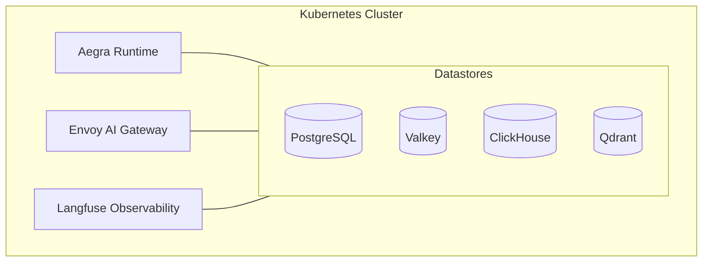

# Zelkor Platform

[](https://opensource.org/licenses/Apache-2.0)
[](https://kubernetes.io/)

Self-hosted infrastructure to deploy, test, govern, and run AI agents in production.

Zelkor wraps battle-tested open-source components — **Aegra**, **Envoy AI Gateway**, **Langfuse**, **NeMo Guardrails**, and **Qdrant** — into a unified Kubernetes deployment. It is an open-source alternative to LangGraph Platform and LangSmith for teams that need to run agents on their own infrastructure.

## Quick Start

Get a local instance running on your laptop in under 5 minutes using Docker and `kind`.

**Prerequisites:** Docker, `kind`, `helm`, `kubectl`, and one LLM provider key (e.g., OpenAI).

```bash
git clone https://github.com/devopssquaddev/zelkor-platform.git
cd zelkor-platform
OPENAI_API_KEY="sk-..." ./install.sh
```

For full details, see the [Local Quickstart Guide](docs/quickstart.md).

## Deployment Options

Zelkor Community Edition can be deployed in three ways:

1. **Local Quickstart:** Laptop-friendly deployment using `kind`. See [docs/quickstart.md](docs/quickstart.md).
2. **Existing Cluster:** Lightweight deployment for evaluating Zelkor on an existing Kubernetes cluster (EKS, GKE, AKS). See [docs/helm-install.md](docs/helm-install.md).
3. **Production Deployment:** Highly available deployment with operators (CloudNativePG, ClickHouse Operator, etc.) for production workloads. See [docs/production.md](docs/production.md).

Gateway setup depends on your cluster — greenfield, layered behind existing ingress, or shared Envoy infrastructure. See [docs/envoy-gateway-topologies.md](docs/envoy-gateway-topologies.md).

## What's Included

Zelkor provides all the core pillars needed for an agentic runtime:

| Component | Role |
|-----------|------|
| **Aegra** | Stateful agent orchestrator (LangGraph alternative) |
| **Envoy AI Gateway** | LLM API gateway, MCP router, and OTel GenAI telemetry |
| **NeMo Guardrails** | CPU-native conversational boundaries and dialog rails |
| **Langfuse** | Observability, tracing, and evaluations |
| **Qdrant** | Semantic memory and vector search |
| **PostgreSQL / Valkey / ClickHouse** | Databases for state, cache, and analytics |

Baseline sandboxing is provided via **gVisor** (`runsc`) for untrusted code execution workloads.

## Architecture



## 🏢 For Enterprise

Need SSO/SAML, hardware sandboxing (Kata Containers), mTLS, audit logging, or HIPAA/PCI DSS compliance packs?

Contact us for **Zelkor Enterprise** — self-hosted Helm charts with operational SLAs and dedicated support.

## License

Apache License 2.0 — see [LICENSE](LICENSE).

## Contributing

See [AGENTS.md](AGENTS.md) and [docs/quickstart.md](docs/quickstart.md).
