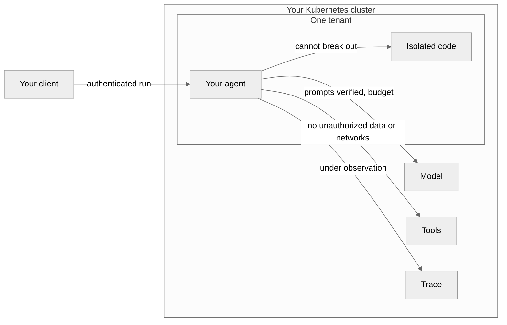

# Zelkor Platform

[](LICENSE)
[](charts/zelkor-platform/Chart.yaml)

You get a **self-hosted agent runtime on your Kubernetes cluster**: bring the agent you already wrote; it is sandboxed — it can't break out, reach unauthorized data or networks, its prompts are verified, budget controlled, and it is under observation; tenants stay isolated.

You configure three things — a **model**, a **tool**, and an **agent**. The laptop install and a shared cluster use the same objects and the same Helm charts. Community Edition is Apache-2.0 and runs from this repository without a sales step.

## Run Community Edition on your laptop

Needs Docker running, `kind`, `helm`, `kubectl`, and one LLM provider key.

```bash
git clone https://github.com/devopssquaddev/zelkor-platform.git
cd zelkor-platform
OPENAI_API_KEY=sk-... ./install.sh
```

`./install.sh` creates a local kind cluster, installs Zelkor Community Edition (chart `2.1.1`), and prints URLs when it finishes. Full prerequisites, other providers, and the first verification call: [Local Quickstart](docs/quickstart.md).

## What you set

| You declare | Platform job |
| :--- | :--- |
| **Model** | Routes chat and embeddings through one gateway; injects the upstream key from a cluster secret |
| **Tool** | Exposes tools over MCP (Model Context Protocol) — SQL, vectors, sandbox, your own backends — without putting secrets in agent code |
| **Agent** | Deploys your LangGraph or Deep Agents workload; you run it and open the trace |

After the local install, point the [`zelkor` CLI](cli/README.md) at the cluster, `zelkor deploy` your project, `zelkor run`, then open the trace UI the install prints (Langfuse). A worked demo lives under [`examples/finserve/`](examples/finserve/README.md) if you want a sample agent — it is not required to learn the platform.

What wraps the agent you already wrote:


```mermaid
---
config:
  theme: neutral
---
flowchart LR
  client[Your client]
  subgraph cluster [Your Kubernetes cluster]
    subgraph tenant [One tenant]
      agent[Your agent]
      code[Isolated code]
    end
    model[Model]
    tools[Tools]
    trace[Trace]
  end
  client -->|authenticated run| agent
  agent -->|cannot break out| code
  agent -->|prompts verified, budget| model
  agent -->|no unauthorized data or networks| tools
  agent -->|under observation| trace
```

The run, the tools, and the trace share one verified tenant identity. The agent cannot choose a different tenant. Another tenant’s rows, vectors, and traces are not reachable from this run. Full hops: [Architecture Hub](docs/architecture.md) and [Tenant Isolation](docs/architecture-tenants.md).

## Editions

| Edition | What you get |
| :--- | :--- |
| **Community Edition** | The self-hosted runtime in this repo: gateway, tools, sandbox, traces, Helm install |
| **Pro** | SSO, team controls (budgets and approvals), and production HA / GitOps on top of CE |
| **Enterprise** | Isolation and compliance on Pro: hardware sandbox, mTLS, retained audit, BAA |

CE is enough to evaluate and to run production-shaped installs. Pro and Enterprise add control-plane and compliance layers — not a different product story.

🏢 **For Enterprise** — isolation, audit retention, and BAA on the same platform shape. Start with [Local Quickstart](docs/quickstart.md); talk to us when CE is running on a shared cluster.

## Docs

| Start here | Job |
| :--- | :--- |
| [Local Quickstart](docs/quickstart.md) | Install CE on kind and prove a model call + a trace |
| [Documentation index](docs/README.md) | Map of every published page |
| [`zelkor` CLI](cli/README.md) | Point at a cluster, deploy your agent, run, inspect |
| [FinServe example](examples/finserve/README.md) | Optional reference agents on top of the platform |
