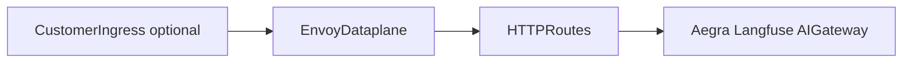

# Agent guide: Install and uninstall Zelkor CE (platform)

**Audience:** Coding agents (Cursor, Claude Code, etc.). Read this before any platform install or uninstall. For deploying **customer agents** after the platform is up, see [agent-deploy.md](agent-deploy.md).

Human-oriented docs: [quickstart.md](quickstart.md) (kind), [helm-install.md](helm-install.md) (existing cluster eval), [production.md](production.md) (HA production).

---

## Architecture primer

Zelkor CE installs in **three layers**:

1. **Operators (production only)** — `scripts/bootstrap-operators.sh`: CloudNativePG, Altinity ClickHouse Operator, cert-manager, optional Barman. Skips when CRDs already exist.
2. **Gateways** — `scripts/bootstrap-gateway.sh`: Gateway API CRDs, Envoy Gateway, Envoy AI Gateway.
3. **Platform** — Helm `charts/zelkor-platform`: datastores (CRs or in-chart), Aegra, Langfuse, MCP, NeMo, Zelkor `Gateway` + HTTPRoutes, ClusterIP **dataplane**.

**North–south:** Customer ingress (Traefik, ALB, nginx) is optional. The **Envoy dataplane** (`{namespace}-{release}-dataplane` in `envoy-gateway-system`) routes by Host to Agent Protocol and Langfuse. The platform chart does **not** create customer Ingress objects.

**In-cluster only (ClusterIP):** MCP gateway, NeMo, AI Gateway `/v1`, Postgres, Valkey, ClickHouse. Do not publish these on ingress unless the customer explicitly opts in (e.g. `gateway.hosts.aiGateway`).



---

## Choose the entrypoint

| Target | Command | Values overlay | Never use |
| :--- | :--- | :--- | :--- |
| Laptop **kind** eval | `./install.sh` | `profiles/values-local.yaml` (via script) | `install-production.sh` on kind unless testing production path |
| **Existing cluster** eval | `./scripts/install-quickstart.sh` | `values-quickstart.yaml` + gateway overlay | `values-local.yaml` |
| **Existing cluster** production HA | `./scripts/install-production.sh` | `values-production.yaml` + gateway overlay | `./install.sh`, `values-local.yaml` |

**Prerequisites:** Kubernetes v1.28+, `kubectl`, Helm v3.10+. At least one LLM env var (`OPENAI_API_KEY`, `ANTHROPIC_API_KEY`, `GEMINI_API_KEY`, `OLLAMA_API_KEY`, `OLLAMA_LOCAL_HOST`, `VLLM_BACKEND_URL`, `AZURE_OPENAI_API_KEY`+`AZURE_OPENAI_ENDPOINT`, `AWS_ACCESS_KEY_ID`+`AWS_SECRET_ACCESS_KEY`, `VERTEX_PROJECT`+`VERTEX_REGION`, `COHERE_API_KEY`). Production requires real DNS: `--hosts-agents` and `--hosts-langfuse` (no `*.localhost` / `*.zelkor.local`).

---

## Greenfield vs brownfield

| Signal | Class | `--topology` | Operators |
| :--- | :--- | :--- | :--- |
| No foreign Envoy Gateway | Greenfield | `greenfield` (default) | Run bootstrap (production) |
| EG and/or existing ingress front door | Brownfield | **`layered`** | `--skip-operators` if CRDs exist |
| Customer owns `Gateway` CR | Brownfield | **`shared`** | `--skip-operators` if CRDs exist |

**Hard rule:** Greenfield **refuses** when Envoy Gateway is already running and was not installed by Zelkor. Use `--topology layered` or `shared` — never force-replace `envoy-gateway-config` on a foreign cluster.

**Layered:** Installer skips EG/AI Gateway install when controllers are already Available. Point customer ingress at `{namespace}-{release}-dataplane:80` and **preserve the Host header**.

**Shared:** Requires `--gateway-class`, `--parent-ref-name`, `--parent-ref-namespace`. Bootstrap uses `--skip-envoy-gateway --skip-ai-gateway`.

Details: [envoy-gateway-topologies.md](envoy-gateway-topologies.md).

---

## Brownfield reconnaissance (before install)

```bash
kubectl get nodes,storageclass
kubectl get crd | egrep 'cnpg|clickhouse|cert-manager|gateway.networking'
kubectl get deploy -n envoy-gateway-system,envoy-ai-gateway-system 2>/dev/null
kubectl get gatewayclass,gateway -A
kubectl get runtimeclass gvisor 2>/dev/null
kubectl get cm -n kube-system zelkor-bootstrap-ownership 2>/dev/null
kubectl get apiservice v1beta1.metrics.k8s.io 2>/dev/null
helm list -A | head
```

Map results to the matrix below; then pick topology, `--skip-operators`, and Helm `--set` adoptions.

### Pre-existing component matrix

| May exist | Detect | Agent action |
| :--- | :--- | :--- |
| CNPG | CRD `clusters.postgresql.cnpg.io` | `--skip-operators`; chart still creates `Cluster` in release ns |
| ClickHouse Operator | CRD `clickhouseinstallations.clickhouse.altinity.com` | same |
| cert-manager | CRD `certificates.cert-manager.io` | same; TLS via `--tls --cluster-issuer` |
| Envoy Gateway | `deploy/envoy-gateway` in `envoy-gateway-system` | `--topology layered` |
| Envoy AI Gateway | `ai-gateway-controller` Available | layered skips AI Gateway Helm |
| GatewayClass `eg` | `kubectl get gatewayclass` | Chart sets `gateway.createGatewayClass=false` if present |
| RuntimeClass `gvisor` | `kubectl get runtimeclass gvisor` | After preflight: `security.sandbox.createRuntimeClass=false`, `security.sandbox.provisioning.mode=none`; pin node selector if needed |
| Ingress controller | Traefik/nginx/etc. | Route Hosts to dataplane Service; not installed by Zelkor |
| Wrong default StorageClass | SC annotation | `--set databases.postgresql.storage.storageClass=...` etc. |
| Too few nodes for PG HA | Ready nodes vs `databases.postgresql.instances` | Lower `instances` or add nodes |
| metrics-server | APIService Available | Required for production HPA; install or accept preflight warn |

**Ownership:** ConfigMap `kube-system/zelkor-bootstrap-ownership` records components **Zelkor bootstrap installed** (`envoy-gateway`, `ai-gateway`, `cnpg`, …). Pre-existing cluster software is not in the map unless Zelkor installed it.

---

## Install secrets

- Auto-generated `POSTGRES_PASSWORD`, `CLICKHOUSE_PASSWORD`, `SEAWEEDFS_*` are **hex** (URL-safe). Override via env before install.
- Manual `CLICKHOUSE_PASSWORD` must be URL-safe (no `+`, `/`, `=`, `@`, `&`) — Langfuse embeds it in migration URLs.
- `--generate-passwords` prints once; **do not log** secrets in chat or commits.
- Installer waits for Langfuse Deployment rollout and `{release}-langfuse-bootstrap` Job.

Example production install:

```bash
OPENAI_API_KEY="sk-..." ./scripts/install-production.sh \
  --namespace zelkor \
  --topology layered \
  --skip-operators \
  --hosts-agents agents.example.com \
  --hosts-langfuse langfuse.example.com
```

Use `--kubeconfig` / `--kube-context` when not using the default context. Quote `--set` flags in zsh (brackets glob).

`--strict` fails on preflight warnings (StorageClass, node count, metrics-server). Fix `--set` first on constrained clusters.

---

## Post-install verify

```bash
kubectl -n <ns> get cluster,clickhouseinstallation
kubectl -n <ns> get secret <release>-langfuse-admin -o jsonpath='{.data.email}' | base64 -d; echo
# Dataplane: installer prints {namespace}-{release}-dataplane.envoy-gateway-system.svc.cluster.local:80
kubectl -n <ns> get gateway <release>-gateway -o jsonpath='{.status.conditions[?(@.type=="Programmed")].status}'; echo
```

Then deploy agents: [agent-deploy.md](agent-deploy.md).

---

## Uninstall

Script: `./scripts/uninstall.sh` (with same `--kubeconfig` / `--kube-context` as install).

| Goal | Flags | Left in cluster |
| :--- | :--- | :--- |
| Remove platform app only (typical brownfield) | default | EG, operators, cert-manager, customer Ingress |
| Drop namespace + PVCs | `--delete-namespace` | same |
| Remove Zelkor-owned EG + AI Gateway | `--purge-gateway` | only if owned; else `SKIP_UNOWNED` |
| Remove Zelkor-owned CNPG / CH op / Barman | `--purge-operators` | never cert-manager via this flag |
| Remove Zelkor-owned cert-manager | `--purge-cert-manager` | opt-in |
| Legacy / no ownership record | `--force-purge` | dangerous on shared clusters |

**Brownfield checklist:**

1. Default uninstall only — do **not** `--purge-gateway` when EG was pre-existing.
2. Check `kubectl -n kube-system get cm zelkor-bootstrap-ownership -o yaml`.
3. Remove customer Ingress / Traefik rules separately if needed (not in product uninstall).
4. Stuck namespace: if ClickHouseInstallation blocks termination, remove CHI finalizers and PVCs, then retry namespace delete.
5. Uninstall **agent** Helm releases (FinServe, `zelkor-agent`) before or separately from platform.

---

## Agent must-not

- Apply `profiles/values-local.yaml` or `./install.sh` on a shared production cluster.
- Bake test hosts or fixtures into `charts/zelkor-platform/`.
- Install or recommend **ingress-nginx** (retired); use Gateway API + Envoy.
- Use raw `kubectl apply` for the platform chart instead of Helm / install scripts.
- Log install secrets or Langfuse admin passwords.

---

## See also

- [production.md](production.md) · [helm-install.md](helm-install.md) · [envoy-gateway-topologies.md](envoy-gateway-topologies.md) · [agent-deploy.md](agent-deploy.md)
