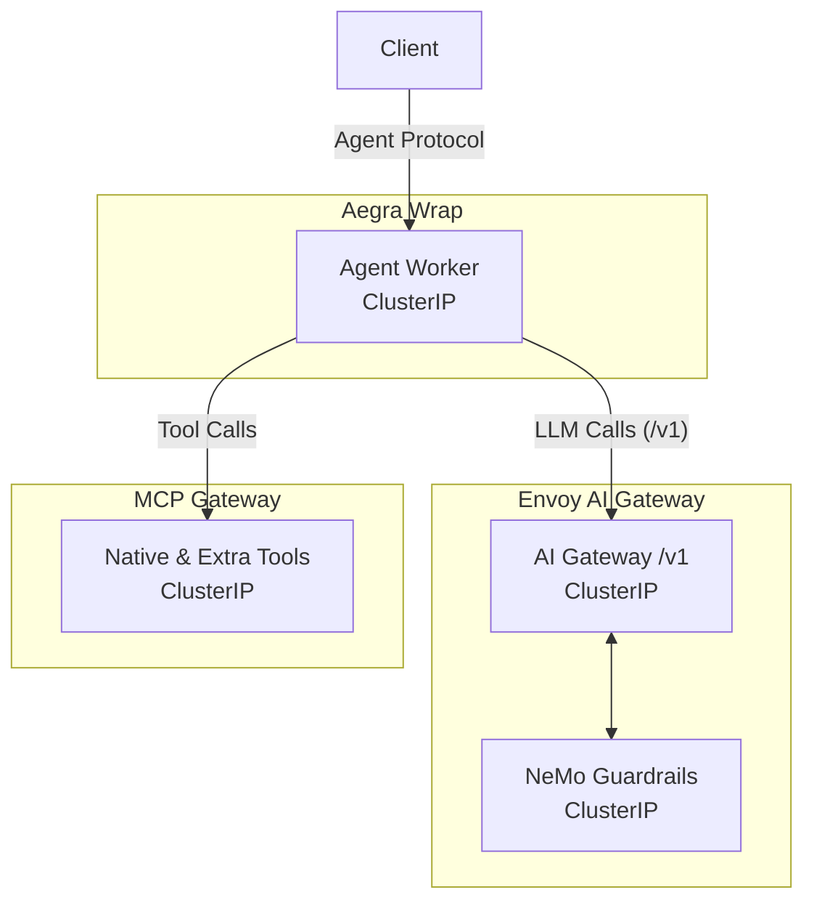

# Drop-In Agent Contract

Zelkor’s core advantage is **"Bring Your Own Agent, We Provide the Armor."** You drop your LangChain, LangGraph, or Aegra agent onto the platform, and Zelkor sandboxes it without requiring you to rewrite your code. 

The agent is sandboxed across multiple dimensions: it cannot break out of its runtime, it cannot reach unauthorized data or networks, its prompts are verified, its budget is controlled, and every action is under observation.

## The Three Planes of Governance

Zelkor applies three planes of governance to your agent. Only **Intercept** and **Wrap** require zero source changes. **MCP** is an opt-in tool protocol.

*Who may talk to whom: The agent is wrapped by Aegra, its LLM calls are intercepted by the AI Gateway, and its tools are governed by MCP.*

### 1. Aegra Wrap (Serve the Graph)

The wrap plane serves your graph and provides the runtime sandbox.
- **Deploy Unit:** Your agent is packaged as an immutable image (`FROM ghcr.io/devopssquaddev/zelkor-aegra`) and deployed as a ClusterIP service.
- **Identity & Isolation:** Tenant authentication happens at the front door. The wrap injects the tenant ID into the graph's environment and thread state.
- **Environment:** The wrap injects `OPENAI_BASE_URL`, `OPENAI_API_KEY` (a consumer key, not the real provider key), and `MCP_URL` into the pod.
- **Network Sandbox:** NetworkPolicies drop outbound traffic. The agent pod cannot reach databases or the internet directly—only the platform gateways.

### 2. Intercept (Envoy AI Gateway)

The intercept plane governs all LLM text generation.
- **No Keys on the Agent:** Real provider API keys stay on the AI Gateway. The agent only holds a consumer key.
- **Prompt Verification:** Traffic to `/v1/chat/completions` is routed through NeMo Guardrails to intercept, check, and verify interactions outside the agent's control.
- **Budget & Observation:** The gateway enforces rate limits, tracks spend, and emits OpenTelemetry traces to Langfuse.

### 3. MCP (Tool Execution)

The Model Context Protocol (MCP) plane governs how the agent executes infrastructure tasks (SQL, vectors, sandbox) and accesses customer SaaS tools.
- **Data Sandbox:** Tools are called through the platform MCP gateway with strict tenant identity. The agent cannot bypass these controls to access other tenants' data.
- **Mode A (Advertise):** If your agent already speaks MCP, it simply calls the injected `MCP_URL`.
- **Mode B (Inject):** Zelkor can dynamically inject MCP tools into your compiled LangChain/LangGraph agent at startup, granting it governed access to Postgres, Qdrant, or your extra backends without source changes.

## Editions as Layers

These planes form the base sandbox. Zelkor editions build upon this foundation:

- **Community Edition:** The self-hosted runtime providing the base sandbox (intercept, wrap, MCP).
- **Pro:** Adds SSO, team controls (budgets and approvals), and production HA / GitOps.
- **Enterprise:** Adds strict isolation and compliance on Pro (hardware sandbox, mTLS, retained audit, BAA).
