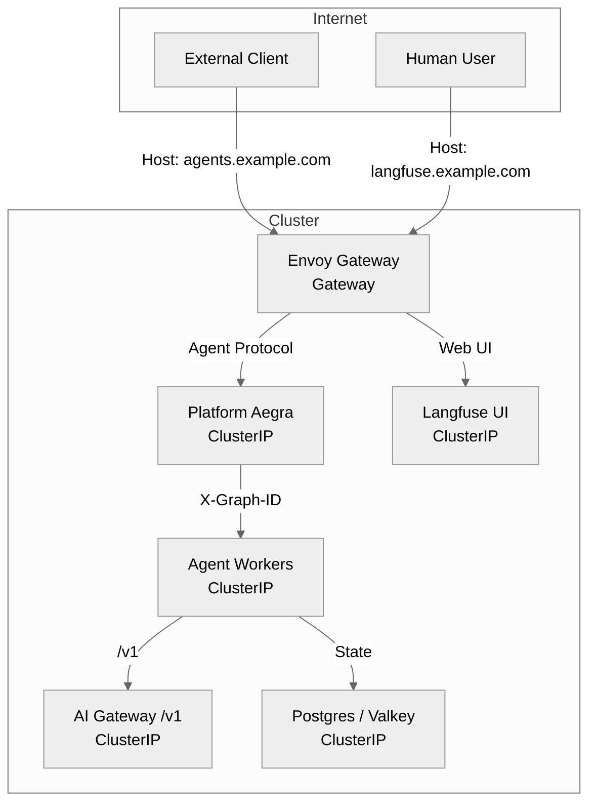

# North-South Exposure

Zelkor is designed to govern your agents securely. To achieve this, it strictly limits what is exposed to the internet (north-south traffic). Everything that agents, Langfuse, NeMo, or MCP call in-cluster stays as a ClusterIP service.

The core advantage: the agent you already wrote is sandboxed — it can't break out, reach unauthorized data or networks, its prompts are verified, budget controlled, and it is under observation.

* **Community Edition** is the self-hosted runtime.
* **Pro** adds SSO, team controls (budgets and approvals), and team GitOps.
* **Enterprise** adds isolation and compliance on Pro (hardware sandbox, mTLS, retained audit, BAA).

## What is published vs ClusterIP

Zelkor uses Envoy Gateway as its AI and graph data plane. It publishes only the necessary product surfaces.

*What is published vs ClusterIP: Only the Agent Protocol front door and Langfuse UI are exposed by default.*

### Published Endpoints

- **Agent Protocol front door (`agents`):** The single north-south host for all Agent Protocol traffic.
- **Langfuse UI (`langfuse`):** The human interface for observability and prompt management.
- **AI Gateway `/v1` (Opt-in):** Only published if you explicitly want a governed OpenAI SDK proxy without the Agent Protocol wrap.

### Internal-Only Endpoints (ClusterIP)

- **Agent Workers:** Customer agents are deployed as separate ClusterIP services. They do not get a public hostname by default.
- **MCP Servers:** Native MCP (Postgres, Qdrant, Sandbox) and extra backends are internal.
- **NeMo Guardrails:** The intercept backend is internal.
- **Datastores:** Postgres, Valkey, ClickHouse, Qdrant, and SeaweedFS are never exposed.

## Ingress Options

Zelkor supports three ingress topologies to fit your environment:

1. **Existing non-Envoy front door (Layered):** You keep your existing Ingress (e.g., ALB, Traefik). It forwards traffic to the internal Envoy Gateway ClusterIP, preserving the `Host` header.
2. **Existing Envoy Gateway (Shared):** Zelkor attaches its `HTTPRoute` and `AIGatewayRoute` resources to your existing Envoy `Gateway`.
3. **New cluster (Greenfield):** Zelkor installs Envoy Gateway and provisions a LoadBalancer for you.
