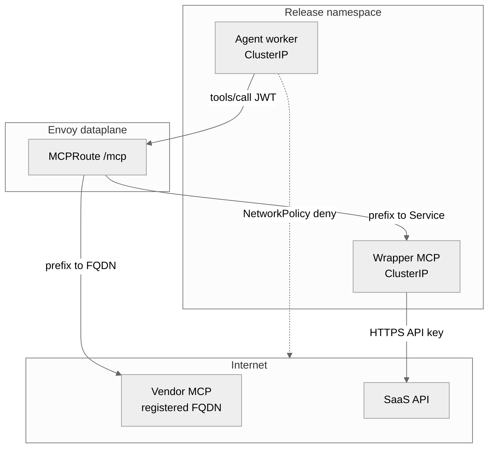
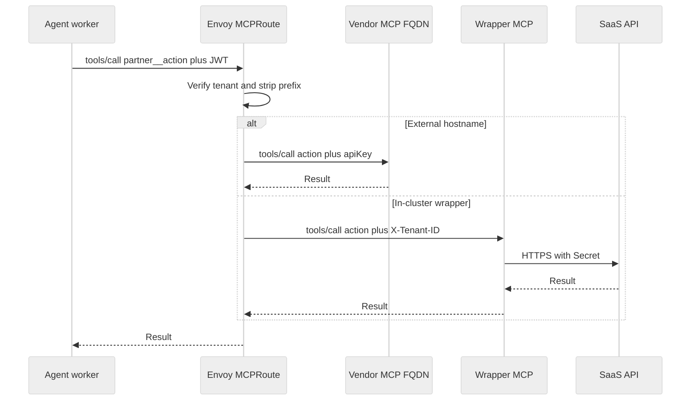

# External and Third-Party MCP
Bring the agent you already wrote; it is sandboxed — it can't break out, reach unauthorized data or networks, its prompts are verified, budget controlled, and it is under observation. Tenants stay isolated.

When your AI agent needs to interact with third-party SaaS platforms like ServiceNow, Jira, or Salesforce, you shouldn't have to rewrite it to handle complex networking and security rules. Zelkor's core advantage is that you can bring the agent you already wrote, and it remains sandboxed. It can't break out or reach unauthorized data and networks, its prompts are verified, its budget is controlled, and it is under observation. Tenants stay strictly isolated.

To achieve this, Zelkor uses an infrastructure-only boundary. Instead of giving the agent direct internet access and API keys, you declare your external tools in the platform's configuration (`workspace.tools.extraBackends`). The platform then generates a unified `/mcp` route on the Envoy dataplane. The agent only ever talks to this single `MCP_URL`. It never picks a destination host and never holds a SaaS token itself.

Zelkor provides native MCP servers for core infrastructure, but we do not ship vendor MCP images for third-party SaaS. You bring your own. This external MCP architecture is available across all editions. Community Edition provides the complete self-hosted runtime. Pro adds SSO, team controls (budgets and approvals), and production HA / GitOps. Enterprise adds strict isolation and compliance on top of Pro (including hardware sandboxes, mTLS, retained audit logs, and BAA support).

## What hops does a tool call take?

Zelkor supports two ways to connect your tools. You set exactly one target (`service` or `fqdn`) per extra backend:

1. **External hostname (`fqdn`):** Envoy dials the external vendor's MCP server directly over the internet. If you configure an `apiKey.secretRef`, the platform injects it during this hop.
2. **In-cluster wrapper (`service`):** You deploy a custom ClusterIP MCP server in your namespace. Envoy forwards the JSON-RPC request along with tenant claim headers. Your wrapper pod holds its own SaaS keys and makes the final API calls.

*Who may talk to whom when NetworkPolicies are enabled.*

The agent cannot call an arbitrary FQDN. It can only request a prefixed tool (like `partner__action`), which Envoy statically maps to the one hostname or Service you registered.

When Kubernetes NetworkPolicies are enabled (`security.networkPolicies.enabled`), the agent's egress is default-deny. It can only reach internal platform services like the AI Gateway, Envoy, NeMo, Langfuse, and DNS. 

Because Envoy is a trusted dataplane that also routes traffic to LLM providers, Community Edition does **not** default-deny Envoy's outbound traffic or pin extra MCP CIDRs on those pods. While you can add `egress.cidrs` to your tool configuration, in Community Edition these are simply optional GitOps notes for your own CNI or a later Pro/Enterprise dataplane allowlist. Helm does not require them, and Zelkor does not emit an Envoy egress NetworkPolicy from that field.

## How are credentials kept off the agent?

This architecture ensures credentials stay completely off the agent workload. In a single call, the agent passes its JWT to Envoy. Envoy verifies the tenant, strips the tool prefix, and either injects the API key (for external hostnames) or passes the tenant identity to your wrapper (which holds the key).

*One call: the agent has a JWT only; the key is on Envoy or on your wrapper pod.*

Zelkor forwards the tenant headers you configure, but it does not enforce row-level security inside a community SaaS MCP. Native Postgres and Qdrant wrappers are the only servers Zelkor guarantees to filter at the row level.

How to register: [Register Extra MCP Backends](mcp-extra-backends.md).
