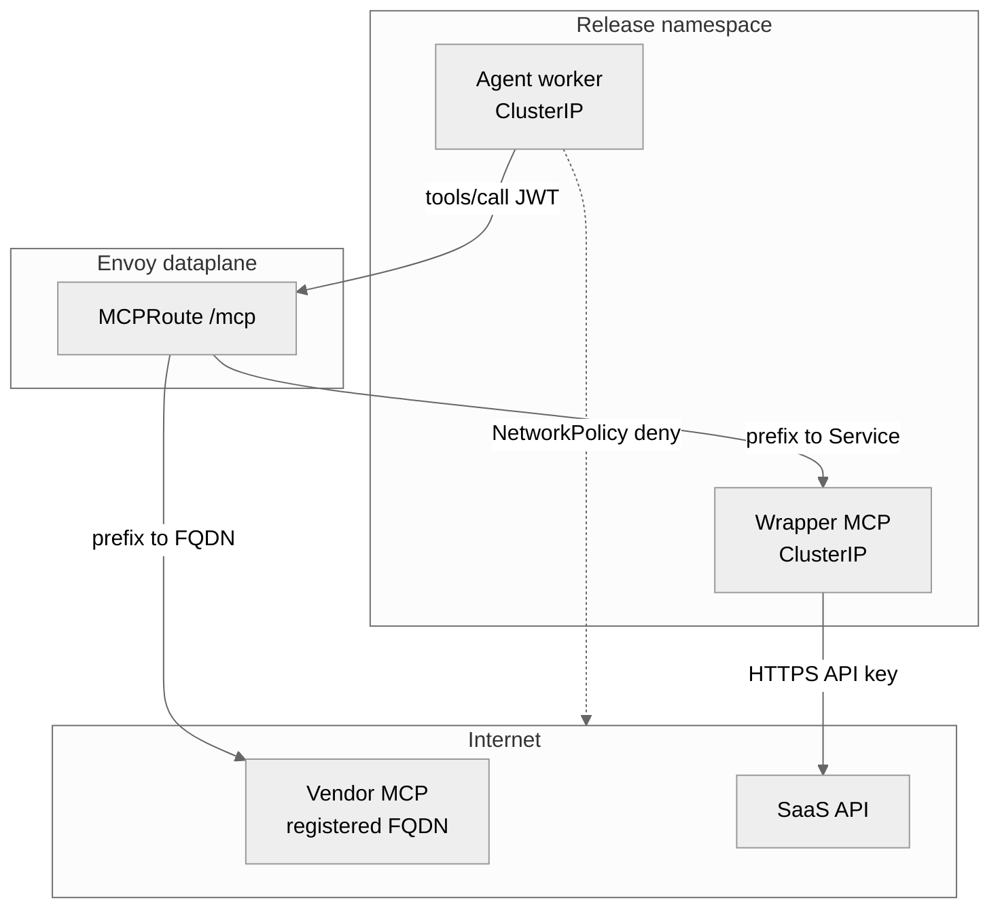
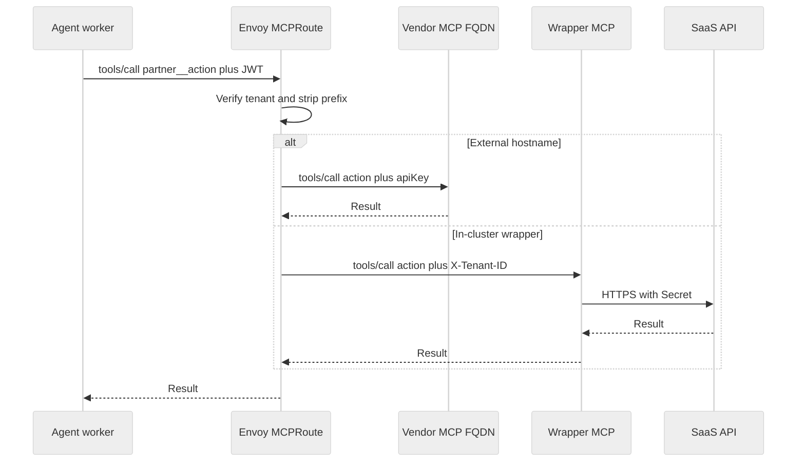

# External and Third-Party MCP

Bring the agent you already wrote; it is sandboxed — it can't break out, reach unauthorized data or networks, its prompts are verified, budget controlled, and it is under observation. Tenants stay isolated.

You declare a **tool** on the platform release (`workspace.tools.extraBackends`). The platform generates the **/mcp** route that lists and calls tools (Envoy MCPRoute) and, for an external hostname, a **Backend**. The agent keeps one `MCP_URL`. It never holds the SaaS token and never picks a host.

Zelkor does not ship vendor MCP images (ServiceNow, Jira, Salesforce). Community Edition is the self-hosted runtime. Pro adds SSO, team controls (budgets and approvals), and production HA / GitOps. Enterprise adds isolation and compliance on Pro (hardware sandbox, mTLS, retained audit, BAA). Envoy dataplane CIDR lockdown is not a Community Edition control.

## What hops does a tool call take?

Two registrations. Set exactly one of `service` or `fqdn` per extra.

1. **External hostname:** Envoy dials the registered FQDN. Optional `apiKey.secretRef` is injected on that hop.
2. **In-cluster wrapper:** You run a ClusterIP MCP. Envoy forwards JSON-RPC and claim headers; that pod holds the SaaS key and calls the API.

*Who may talk to whom when NetworkPolicies are on.*

The agent cannot call an arbitrary FQDN. It calls a prefixed tool (`partner__action`). Envoy maps that prefix to the **one** hostname or Service you registered.

With `security.networkPolicies.enabled`, agent (and Aegra) egress is default-deny except AI Gateway, Envoy, NeMo, Langfuse, and DNS. Envoy is trusted dataplane: it also reaches LLM providers. Community Edition does **not** default-deny Envoy outbound or pin extra MCP CIDRs on those pods.

`egress.cidrs` on an extra is optional GitOps notes for **your** CNI or a later Pro/Enterprise dataplane allowlist. Helm does not require it. Zelkor does not emit an Envoy egress NetworkPolicy from that field.

## How are credentials kept off the agent?

*One call: agent has JWT only; the key is on Envoy or on your wrapper pod.*

Zelkor forwards tenant headers you configure. It does not enforce row-level security inside a community SaaS MCP. Native Postgres and Qdrant wrappers are the servers Zelkor guarantees to filter.

How to register: [Register Extra MCP Backends](mcp-extra-backends.md).
