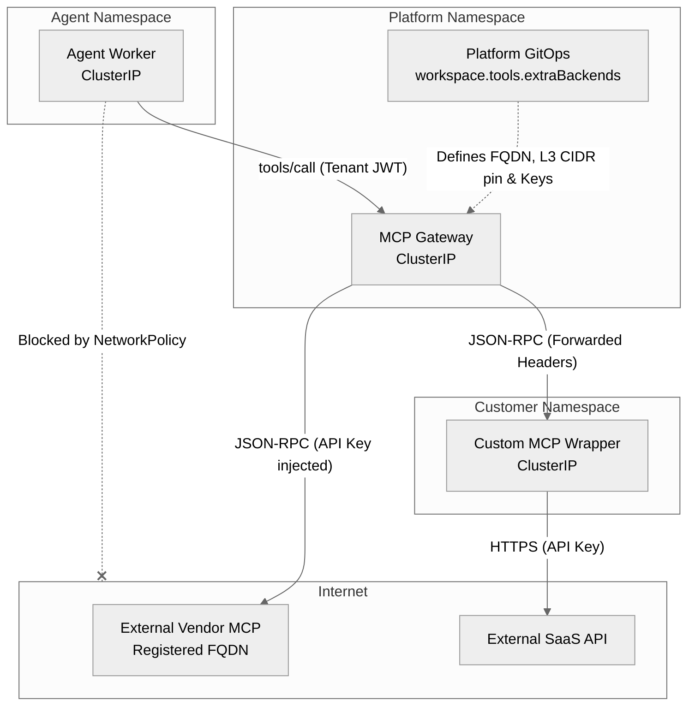
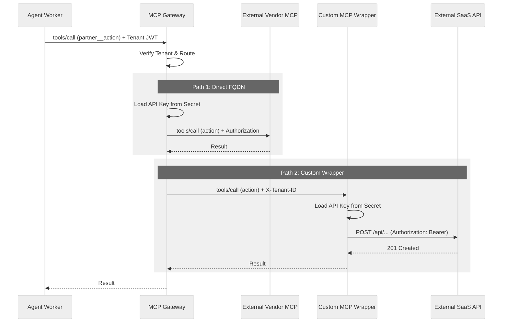

# External and Third-Party MCP

Zelkor's core advantage is that the agent you already wrote is sandboxed — it can't break out, reach unauthorized data or networks, its prompts are verified, budget controlled, and it is under observation.

For third-party SaaS integrations (like ServiceNow, Jira, Salesforce, or Slack), Zelkor enforces an **Infrastructure-Only Boundary**. Zelkor provides native MCP servers for core infrastructure (compute, storage, memory, LLM egress), while you bring your own third-party MCP servers. These external MCP servers are registered on the unified MCP gateway, ensuring that your agent remains isolated and never holds SaaS credentials.

## What is the trust boundary for external SaaS?

When an agent needs to interact with an external SaaS API or vendor MCP, it must go through the unified MCP Gateway. The agent itself has no direct internet access. 

Zelkor supports two deployment models for external MCP servers:

1. **Direct FQDN (Out-of-the-box):** The MCP Gateway routes directly to an external vendor's MCP server over the internet. You define the target FQDN in the platform's GitOps configuration (`workspace.tools.extraBackends`). The agent cannot call an arbitrary FQDN; it only calls a prefixed tool name (e.g., `partner__action`), and the gateway statically routes that to the registered FQDN and injects the API key.
2. **Custom Wrapper (ClusterIP):** You deploy a custom MCP server in your namespace to wrap a SaaS API. The gateway forwards the request and tenant headers to your pod, which then calls the SaaS API.

### Understanding the FQDN vs. CIDR Boundary

A common misconception is that defining a CIDR block gives the agent access to the whole internet or any FQDN within that range. This is incorrect:

- **The Agent (L7 restriction):** The agent never chooses a host. It only calls the `MCP_URL` with a prefixed tool name. The gateway maps that prefix to exactly one statically registered FQDN.
- **The Gateway (L3 declarative pin):** When NetworkPolicies are enabled, Helm requires you to declare `egress.cidrs` for external FQDNs. This is a cluster-admin blast-radius control (an L3 pin for the vendor's IP range), not an agent control. Even if an admin provides `0.0.0.0/0`, the agent is still restricted to the single registered FQDN.

## How are credentials isolated?

Zelkor ensures that tool secrets (like SaaS tokens or database passwords) are never exposed to the agent process. 

1. **Agent Request:** The agent sends a tool call to the unified MCP Gateway, including its Tenant JWT.
2. **Gateway Verification:** The MCP Gateway verifies the tenant identity and ensures the agent is authorized to use the requested tool.
3. **Routing & Credential Injection:** 
   - **For Direct FQDN:** The gateway strips the tool prefix, injects the SaaS API key (loaded from a Kubernetes Secret), and forwards the request directly to the external vendor MCP.
   - **For Custom Wrappers:** The gateway strips the prefix and forwards the request with tenant headers to your extra MCP pod. Your pod holds the actual SaaS API key and makes the authenticated call.

## Bring Your Own MCP (BYO MCP)

You register your external or custom MCP servers on the platform release using the `workspace.tools.extraBackends` configuration.

- **Network Policies:** When `security.networkPolicies.enabled` is true, the agent's egress is default-deny. It can only reach the MCP Gateway. For external FQDN targets, Helm requires you to declare `egress.cidrs` as a network-layer pin for the vendor's IP range.
- **Identity Honesty:** When using custom wrappers, the MCP Gateway fronts tenant identity by forwarding headers (e.g., `X-Tenant-ID`). Your custom MCP server is responsible for honoring this tenant context when interacting with the SaaS API, or you can deploy one MCP server per tenant.

For instructions on registering an external MCP server, see the [Register Extra MCP Backends](mcp-extra-backends.md) guide.
