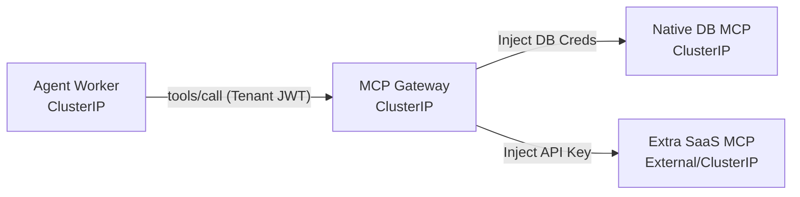

# MCP Governance

Zelkor unifies access to databases and SaaS tools via the Model Context Protocol (MCP). It intercepts and governs every tool call to enforce tenant isolation and protect credentials.

The core advantage: your agent is sandboxed, and tool secrets (like SaaS tokens or database passwords) are never exposed to the agent process.

*How a tool call is isolated: The agent calls the gateway with its tenant identity; the gateway attaches the secret and routes the call.*

## The Boundary

You declare the **Tool** and its secret in GitOps. The platform generates the **MCP Gateway routes**, configures the **Native MCP servers** (e.g., Postgres, Qdrant), and injects the endpoints into the agent environment (`MCP_URL`).

When the agent wants to query a database or call a SaaS tool, it sends the request to the MCP Gateway along with its Tenant JWT. The gateway verifies the tenant, ensures they are authorized for the tool, injects the real backend password or API key, and forwards the request. The agent never holds the connection string or the SaaS token.
