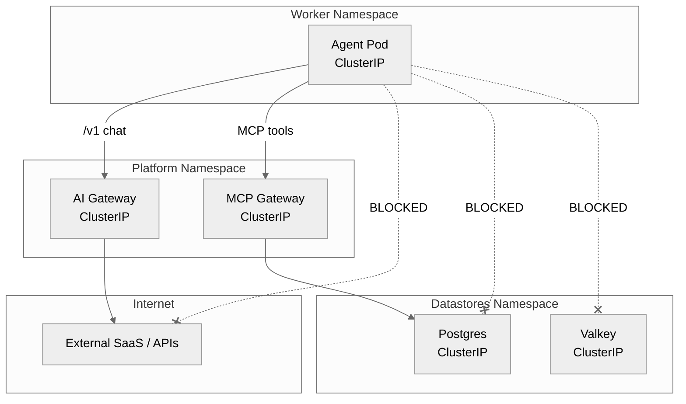

# Network Boundaries

Zelkor enforces zero-trust boundaries around your agent workload. It uses strict Kubernetes NetworkPolicies to ensure the agent cannot bypass governance.

The core advantage: your agent is sandboxed and cannot reach unauthorized data or dial out to the internet directly.

*Who may talk to whom: NetworkPolicies drop all outbound traffic from the agent except to the platform gateways.*

## The Boundary

You provide the **Agent Code**. The platform generates the **NetworkPolicies** and **Gateways**.

By default, an agent pod cannot open a connection to the internet, nor can it talk directly to the underlying datastores (Postgres, Valkey, Qdrant). All its interactions must go through the platform's AI Gateway for LLM calls and the MCP Gateway for tool calls and data access. This guarantees that observability, guardrails, and tenant isolation cannot be bypassed.
