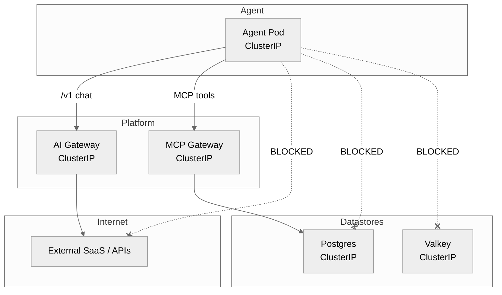

# Network Boundaries

When NetworkPolicies are on, the agent cannot bypass the gateways. The production install turns them on. A chart install that leaves `security.networkPolicies.enabled` false does not restrict pod traffic.

The core advantage: your agent is sandboxed and cannot reach unauthorized data or dial out to the internet directly.

*Who may talk to whom: NetworkPolicies drop all outbound traffic from the agent except to the platform gateways.*

## The Boundary

You provide the **Agent Code**. The platform generates the **NetworkPolicies** and **Gateways**.

The chart default is `security.networkPolicies.enabled: false`, so traffic is not restricted. The [production install](production.md) sets the flag to true. An agent pod then cannot open a connection to the internet, nor can it talk directly to Postgres, Valkey, or Qdrant. LLM calls go through the AI Gateway. Tool and data calls go through the MCP gateway. Observability, guardrails, and tenant checks on those paths cannot be skipped by dialing the datastore or the provider directly.
