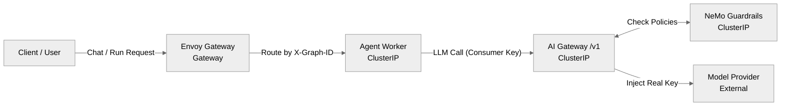

# Request Path

This page details how an external chat or run request flows through Zelkor to the agent, and how the agent reaches the model provider. 

The core advantage is enforced on this path: the agent you already wrote is sandboxed, and provider keys stay on the gateway.

*How a client call reaches the model: The call is routed to the agent, which then makes an intercepted call through the AI Gateway.*

## The Boundary

You deploy the **Agent** and configure the **Model**. The platform generates the **Envoy HTTPRoutes**, the **AI Gateway intercept**, and the **NeMo policies**.

The agent is never given the real provider key (e.g., your actual OpenAI API key). It is injected with a local consumer key (`OPENAI_API_KEY`) and its traffic is forced to `OPENAI_BASE_URL` pointing at the internal AI Gateway. 

The AI Gateway applies a **global request cap** on `/v1` (chart default 50 requests per minute). Over the cap, the gateway returns HTTP 429 and does not call the provider — so a looping agent cannot run an unbounded bill. That cap is a request count shared by the install, not a dollar budget. **Pro** adds per-team USD and token ceilings with model downshift on the same path. The gateway also applies guardrails via NeMo, injects the real provider credentials from a Kubernetes Secret, and forwards allowed requests to the upstream model provider.
