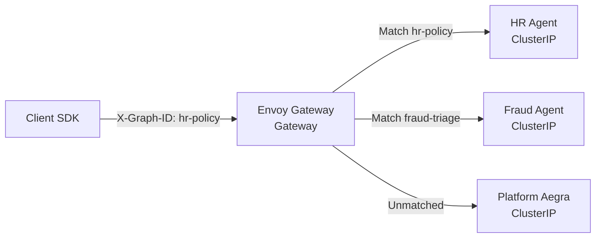

# Envoy Graph Routing

Zelkor routes incoming Agent Protocol traffic to the correct agent deployment using Envoy Gateway. This ensures that a single public endpoint can serve many independently released agents.

## How a client call reaches a graph

When a client makes a request to the public Agent Protocol host, Envoy uses the `X-Graph-ID` header or `?graph_id=` query parameter to route the call to the specific agent's ClusterIP service.

*How a client call reaches a graph: Envoy matches the graph ID and routes to the corresponding worker deployment.*

### The Routing Contract

- **Match:** Envoy matches the `X-Graph-ID` header or `graph_id` query parameter. It does not inspect the JSON body.
- **Behavior:** A matched ID routes to that deployment's ClusterIP service. If the key is unmatched or absent, traffic falls back to the default backend (Platform Aegra).
- **Authentication:** Envoy handles TLS and routing. Authentication (JWT or dev tokens) happens in-process within each Aegra deployment.

### Single Backend (Drop-in)

If you only have one agent deployment attached to the gateway, you don't need to specify a routing key. Envoy routes all traffic on the root path `/` directly to that service, making it a transparent drop-in for existing clients.

### Redis and SSE Isolation

Each executing deployment uses a unique `REDIS_CHANNEL_PREFIX` (e.g., `aegra:hr-policy:run:`). This isolates Server-Sent Events (SSE) and job queues, ensuring that multiple deployments sharing the same Valkey broker do not steal each other's jobs or mix up streaming responses.
