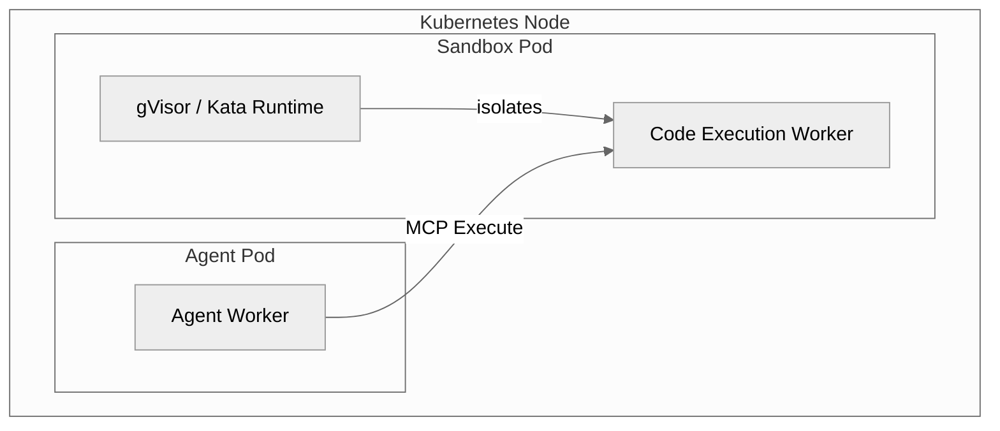

# Sandbox Isolation

*Where generated code runs: The agent delegates execution to a separate pod running a hardened sandbox runtime.*

When an agent needs to execute generated Python code or manipulate files, it does not do so in its own container. Zelkor isolates code execution to protect the cluster and the agent itself.

The core advantage: the agent you wrote is sandboxed, and any code it generates cannot break out or compromise the system.

## The Boundary

You configure the **Agent** to use the sandbox tool. The platform provisions the **Sandbox Pods** using hardware or kernel-level virtualization.

Instead of running arbitrary `exec()` calls in-memory, the agent uses the platform's Sandbox MCP. The code is sent to a dedicated pool of sandbox workers. 

In **Community Edition**, these workers use gVisor to intercept syscalls and isolate the kernel. In **Enterprise**, they use Kata Containers for hardware-level virtual machine isolation. Generated code cannot break out of that pod onto the node.

## Which nodes run the sandbox

The agent pod stays on the normal runtime. Only the sandbox worker asks for RuntimeClass `gvisor`.

On a containerd cluster, Zelkor can install `runsc`, but that restarts the node runtime. An existing-cluster install does this only when you opt in and name a sandbox pool. Workers then run only on nodes labeled `zelkor.io/gvisor-ready=true`. Kind installs gVisor on its single node without that flag.

OpenShift and CRI-O cannot take this installer. GKE Sandbox and Talos already provide the runtime; Zelkor uses that RuntimeClass and does not install `runsc`. The install choice is in [Production Install](production.md).
