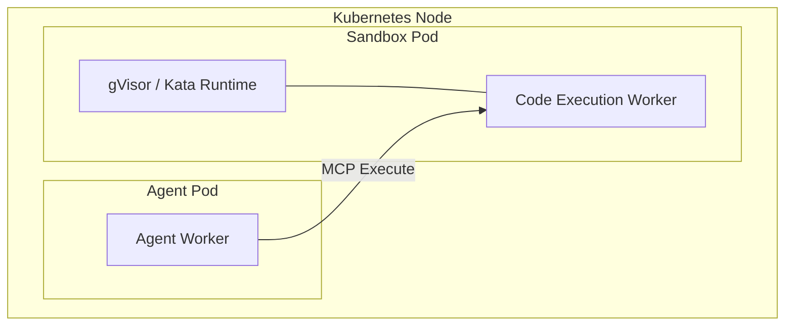

# Sandbox Isolation

When an agent needs to execute generated Python code or manipulate files, it does not do so in its own container. Zelkor isolates code execution to protect the cluster and the agent itself.

The core advantage: the agent you wrote is sandboxed, and any code it generates cannot break out or compromise the system.

*Where generated code runs: The agent delegates execution to a separate pod running a hardened sandbox runtime.*

## The Boundary

You configure the **Agent** to use the sandbox tool. The platform provisions the **Sandbox Pods** using hardware or kernel-level virtualization.

Instead of running arbitrary `exec()` calls in-memory, the agent uses the platform's Sandbox MCP. The code is sent to a dedicated pool of sandbox workers. 

In **Community Edition**, these workers use gVisor to intercept syscalls and isolate the kernel. In **Enterprise**, they use Kata Containers for hardware-level virtual machine isolation. This ensures that even if the agent generates malicious code, it cannot break out of the sandbox or access node resources.
