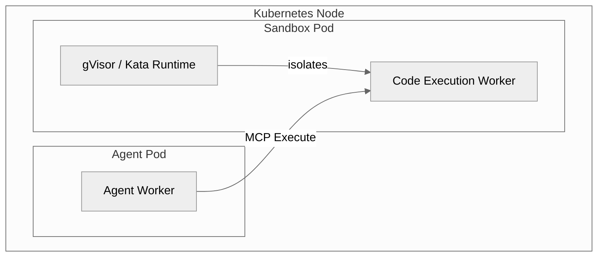

# Sandbox Isolation

*Where generated code runs: The agent delegates execution to a separate pod running a hardened sandbox runtime.*

When an agent needs to execute generated Python code or manipulate files, it does not do so in its own container. Zelkor isolates code execution to protect the cluster and the agent itself.

The core advantage: **the self-hosted agent runtime** — bring the agent you already wrote, and any code it generates executes in an isolated sandbox pod so it cannot break out or compromise the system.


```mermaid
---
config:
  theme: neutral
---
flowchart TB
  subgraph Node[Kubernetes Node]
    subgraph AgentPod[Agent Pod]
      Agent[Agent Worker]
    end
    
    subgraph SandboxPod[Sandbox Pod]
      gVisor[gVisor / Kata Runtime]
      Worker[Code Execution Worker]
      gVisor -- "isolates" --> Worker
    end
  end

  Agent -- "MCP Execute" --> Worker
```

## The Boundary

You configure the **Agent** to use the sandbox tool. The platform provisions the **Sandbox Pods** using hardware or kernel-level virtualization.

Instead of running arbitrary `exec()` calls in-memory, the agent uses the platform's Sandbox MCP. The code is sent to a dedicated pool of sandbox workers. 

In **Community Edition**, these workers use gVisor to intercept syscalls and isolate the kernel. In **Enterprise**, they use Kata Containers for hardware-level virtual machine isolation. Generated code cannot break out of that pod onto the node.

| Hop | From → to | What holds the boundary |
| :--- | :--- | :--- |
| 1 | Agent → MCP gateway (`MCP_URL`) | Tenant JWT; the agent sees only the tools its scope allows |
| 2 | MCP gateway → Sandbox MCP | The agent pod has no sandbox worker address and cannot skip this hop |
| 3 | Sandbox MCP → sandbox worker pod | Worker runs on RuntimeClass `gvisor` (`runsc`): a user-space kernel, not the node's kernel |
| 4 | Sandbox worker → anywhere | No outbound network; no host mounts or container runtime socket |

The stock worker image includes pandas and numpy. It has no outbound network, so packages are installed in the image, not by the code that runs. Extra libraries are an image built `FROM` that worker. The warm pool runs that one image. Steps: [Add Python libraries to the sandbox](sandbox-python-libraries.md).

[//]: # (zelkor-proof shell-moved begin)
### Proof: Generated code runs off the host kernel

**Problem.** If an agent is compromised, the code it generates runs wherever `exec()` runs. In most stacks that is the agent pod, on the node's kernel, next to the agent's credentials.

**Where it holds.** Agent → MCP gateway → Sandbox MCP → sandbox worker pod on RuntimeClass `gvisor`. The agent pod has no worker address.

```bash
$ kubectl get runtimeclass gvisor
$ kubectl -n zelkor get pods -l app.kubernetes.io/component=mcp-sandbox-worker -o jsonpath='{range .items[*]}{.spec.runtimeClassName}{"\n"}{end}'
$ kubectl -n zelkor get pod <agent-pod> -o jsonpath='rc=[{.spec.runtimeClassName}]'
$ kubectl -n zelkor exec <agent-pod> -- cat /proc/version
$ kubectl -n zelkor exec <sandbox-worker> -- cat /proc/version
$ kubectl -n zelkor exec <sandbox-worker> -- sh -c 'ls -d /host; ls -l /var/run/docker.sock'
```

**Result.** Every sandbox worker reports `gvisor`; the agent pod reports no RuntimeClass. The agent pod sees the host kernel (`6.1.0`); the worker sees `4.19.0-gvisor`. The worker has no `/host` mount and no container runtime socket, and creating a block device fails with `PermissionError`.

Every command exited 0 on a lab cluster running chart `2.4.3` on 2026-11-07. Security promises: Code Execution, Network Isolation ([threat model](threat-model.md#_3-security-promises-ce)).

[//]: # (zelkor-proof shell-moved end)

## Which nodes run the sandbox

The agent pod stays on the normal runtime. Only the sandbox worker asks for RuntimeClass `gvisor`.

On a containerd cluster, Zelkor can install `runsc`, but that restarts the node runtime. An existing-cluster install does this only when you opt in and name a sandbox pool. Workers then run only on nodes labeled `zelkor.io/gvisor-ready=true`. Kind installs gVisor on its single node without that flag.

OpenShift and CRI-O cannot take this installer. GKE Sandbox and Talos already provide the runtime; Zelkor uses that RuntimeClass and does not install `runsc`. The install choice is in [Production Install](production.md).
