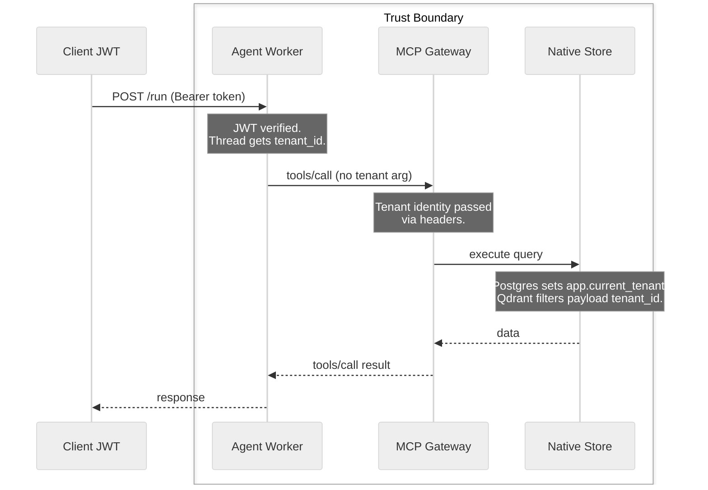

# Tenant Isolation

A **tenant** is the logical boundary for data and access. Depending on your business, a tenant might be a customer organization (`Acme_Corp`, `Bank_Alpha`) in a B2B platform, an internal department (`HR`, `Engineering`) in an enterprise tool, or an individual user (`user_123`) in a B2C app.

Zelkor isolates these tenants across the platform. One verified identity scopes the run, the tools, and the trace. The agent cannot choose a different tenant. Another tenant’s rows, vectors, and traces are not reachable from this run.

The core advantage: the agent you already wrote is sandboxed — it can't break out, reach unauthorized data or networks, its prompts are verified, budget controlled, and it is under observation.

* **Community Edition** is the self-hosted runtime.
* **Pro** adds SSO, team controls (budgets and approvals), and team GitOps.
* **Enterprise** adds isolation and compliance on Pro (hardware sandbox, mTLS, retained audit, BAA).

*How a tenant identity scopes a run. The agent code never supplies the `tenant_id` to the tools; it is enforced by the platform.*

## One Identity Per Run

The platform extracts the tenant identity from a verified JWT at the front door. This identity is injected into the agent worker's thread state. The agent code does not parse the token, and it cannot forge a different identity.

**No Default Tenant:** To ensure strict isolation, Zelkor does not have a "default" or "fallback" tenant. If a request lacks a valid JWT, or if the token is missing the required tenant claim, the platform fails closed and rejects the request. There is no global tenant that can access all data.

## Tool Governance

When the agent calls a tool via the Model Context Protocol (MCP), it cannot pass a `tenant_id` argument. If an agent tries to supply one, the `tools/call` request fails closed. The MCP Gateway receives the tenant identity from the platform's internal headers, ensuring the agent cannot spoof another tenant.

## Native Store Filtering

Native MCP servers (like Postgres and Qdrant) apply this tenant identity directly to their queries. 
- In **Postgres**, each call sets `app.current_tenant` to the verified tenant. The server does not rewrite the SQL. Row-level security applies only when your policies read that setting.
- In **Qdrant**, search and scroll filter on payload `tenant_id`. Upsert stamps that field from the verified tenant.

Extra MCP backends (Bring Your Own) receive the tenant identity in headers but are responsible for applying their own filters (see [Extra Backends](mcp-extra-backends.md)).

## Langfuse Tracing

Every run trace emitted to Langfuse is tagged with the user identity derived from the JWT. Traces are naturally partitioned, and one tenant cannot query or view traces belonging to another.
