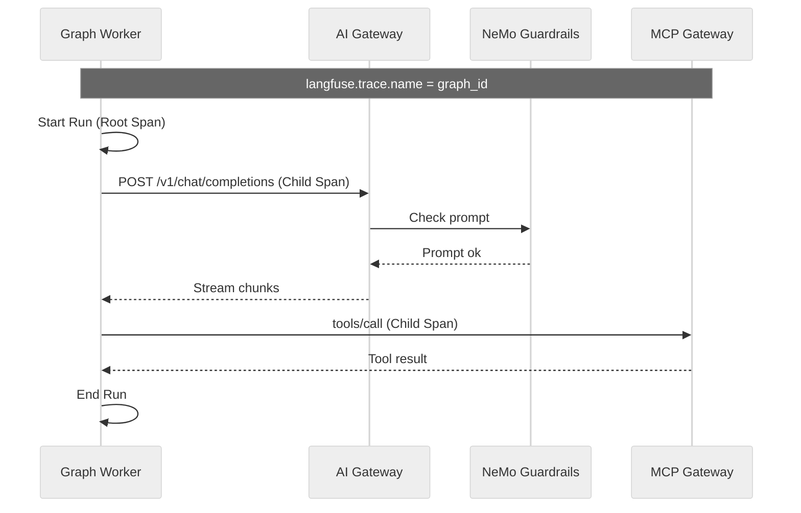

# Run Trace

One run is one trace. You bring the agent you already wrote. You do not add tracing code to it.

The agent is sandboxed: it can't break out, reach unauthorized data or networks, its prompts are verified, budget controlled, and it is under observation. Tenants stay isolated.

* **Community Edition** is the self-hosted runtime.
* **Pro** adds SSO, team controls (budgets and approvals), and team GitOps.
* **Enterprise** adds isolation and compliance on Pro (hardware sandbox, mTLS, retained audit, BAA).

Langfuse is the UI that stores the trace. A span is one step in that trace (the run root, a model call, or a tool call). [Agent Protocol](reference/agent-protocol.md) is how a client starts the run. The trace name is the graph id you sent. See [Envoy Graph Routing](architecture-routing.md).

*What one run looks like: The graph, the AI Gateway intercept, and the tool calls all share the same trace context.*

## The Boundary

You deploy the agent as a ClusterIP workload. It is not the public edge. The platform injects OpenTelemetry headers (the ids that tie spans to this run) into that pod. The real provider key and the model call stay on the AI Gateway. See [Drop-In Agent Contract](architecture-agent-contract.md) and [North-South Exposure](architecture-exposure.md).

The AI Gateway records the prompt and completion that actually went to the provider, and NeMo Guardrails records the prompt check. The graph worker records the run. Langfuse joins those spans on the thread id (`sessionId`) and the `run_id`. Tool calls use the `MCP_URL` the platform injects. You do not instrument the agent.

## Trace Scores

Open the trace in Langfuse and read the score on the span. These scores do not grade the answer. A **false** score points at the span that failed the check. The score comment says why.

A native prefix is the tool name the platform assigns, such as `postgres__`, `qdrant__`, `sandbox__`, or `aigateway__`.

| Score | Attached to | True | False |
| :--- | :--- | :--- | :--- |
| `zelkor-mcp-prefix` | Tool span | Name starts with a native prefix | No native prefix |
| `zelkor-tenant-userid` | Run root | `user_id` or `tenant_id` is set | Both are missing |
| `zelkor-tool-repeat` | Tool span | This tool name is not a repeat | The same tool name was already used |
| `zelkor-sandbox-clean` | Tool span | No `sandbox.violation` | A sandbox violation is set |
| `zelkor-step-budget` | Run root | `tool_names` has at most 25 entries | More than 25 names, or the list is missing |
| `zelkor-tool-names` | Run root | `tool_names` is a list of strings | Missing, or not names only |
| `zelkor-refusal-present` | Model call | The output looks like a refusal | The output is ordinary text |
| `zelkor-tool-succeeded` | Tool span in error | Never | The tool span is already an error |

`zelkor-refusal-present` is a detector. **True** means the model text looks like a refusal ("I'm sorry", "I cannot help"). A normal answer is **false**.

`zelkor-tool-succeeded` runs only on a tool span that is already an error, and the value is always **false**. A healthy tool call has no score of that name.

Quickstart and production turn these scores on. Set `platform.telemetry.langfuse.surfaces.evaluators.seedCode` to `false` to leave them off.
