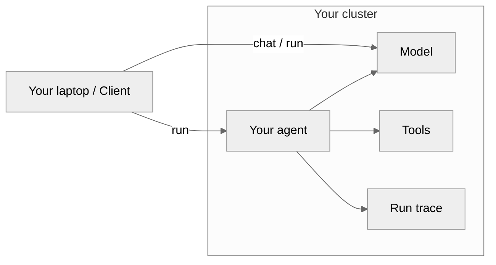

# Architecture Hub

Zelkor compiles your intent into a distributed system that sandboxes the agent you already wrote. The agent cannot break out, reach unauthorized data or networks, its prompts are verified, budget controlled, and it is under observation; tenants stay isolated.

This hub maps the hops and boundaries that enforce that sandbox.

*High-level flow: You deploy an agent. It communicates strictly through governed model and tool gateways, emitting a trace.*

## Deep Dives

Each page answers one specific architectural question about how traffic flows and where the trust boundaries lie:

| Page | Question |
| :--- | :--- |
| [Request Path](architecture-request-path.md) | How a client call reaches the model |
| [Network Boundaries](architecture-network.md) | Who may talk to whom inside the cluster |
| [Sandbox Isolation](architecture-sandbox.md) | Where generated code executes |
| [MCP Governance](architecture-mcp.md) | How a tool call is isolated and authenticated |
| [Run Trace](architecture-trace.md) | What one run looks like in Langfuse |
| [North-South Exposure](architecture-exposure.md) | What is published to the internet versus ClusterIP |
| [Envoy Graph Routing](architecture-routing.md) | How Envoy routes incoming calls to the correct agent deployment |
| [Drop-In Agent Contract](architecture-agent-contract.md) | How Zelkor sandboxes your agent (Intercept, Wrap, MCP) |
| [Tenant Isolation](architecture-tenants.md) | How one tenant identity is applied on a run |
| [Agent Datastores](architecture-datastores.md) | Stateful infrastructure (Postgres, Qdrant) and BYO options |
