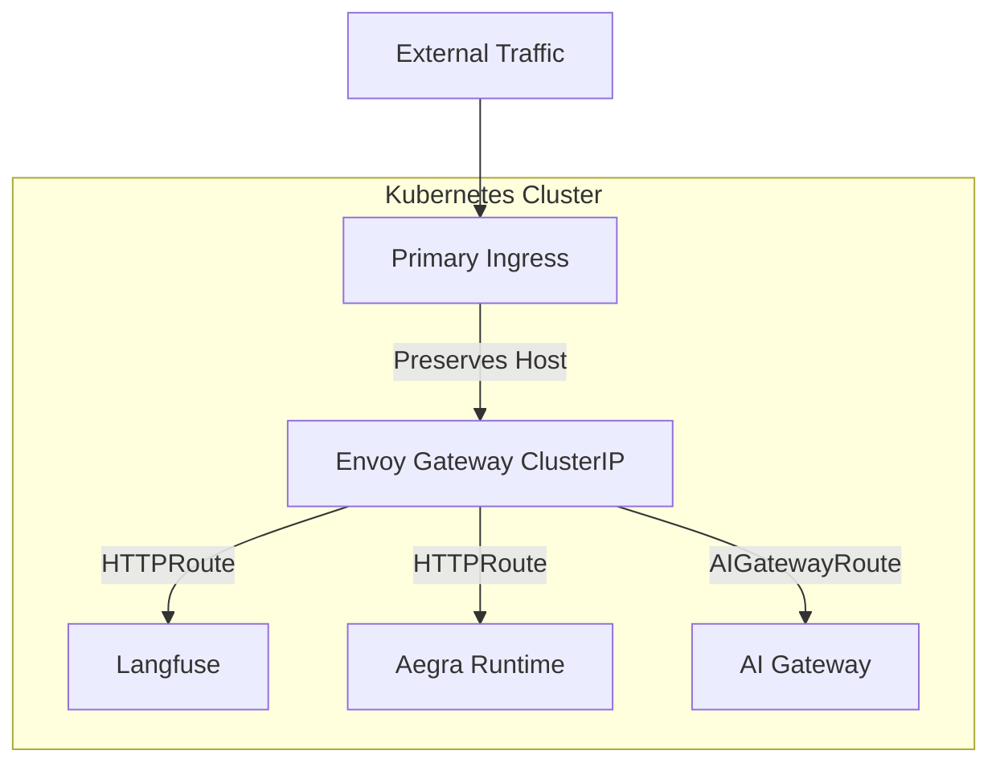

# Envoy Gateway Deployment Topologies

Zelkor relies on **Envoy Gateway** (Kubernetes Gateway API routing) and **Envoy AI Gateway** (LLM routing, rate limits, observability). Your cluster may already run one or both — pick the scenario that matches your environment.

| Scenario | When | Bootstrap script | Helm overlay |
| :--- | :--- | :--- | :--- |
| **Greenfield** | No ingress, or Zelkor is the primary north–south entry | `./scripts/bootstrap-gateway.sh` | `profiles/values-gateway-greenfield.yaml` |
| **Layered** | Existing ingress (NGINX, Traefik, ALB) stays the front door | `./scripts/bootstrap-gateway.sh` | `profiles/values-gateway-layered.yaml` |
| **EG only** | Envoy Gateway installed; AI Gateway extension missing | `./scripts/bootstrap-gateway.sh --skip-envoy-gateway --patch-extension-manager` | `profiles/values-gateway-shared.yaml` |
| **Shared** | Both EG and AI Gateway already running | `./scripts/bootstrap-gateway.sh --skip-envoy-gateway --skip-ai-gateway` | `profiles/values-gateway-shared.yaml` |

Compose any overlay with `profiles/values-production.yaml` (production) or `profiles/values-quickstart.yaml` (evaluation on existing Kubernetes). The install wrappers accept the same choice as `--topology greenfield|layered|shared` and call `bootstrap-gateway.sh` for you:

```bash
OPENAI_API_KEY=sk-... ./scripts/install-quickstart.sh --topology layered
OPENAI_API_KEY=sk-... ./scripts/install-production.sh --topology greenfield \
  --hosts-agents agents.example.com --hosts-langfuse langfuse.example.com --generate-passwords
```

---

## Greenfield (LoadBalancer dataplane)

**When:** New cluster or Zelkor owns external routing. No competing ingress controller.

### 1. Bootstrap gateways

```bash
./scripts/bootstrap-gateway.sh
# Optional: --kubeconfig PATH --kube-context NAME
```

### 2. Deploy Zelkor

```bash
helm upgrade --install zelkor-platform charts/zelkor-platform \
  -f profiles/values-production.yaml \
  -f profiles/values-gateway-greenfield.yaml \
  --namespace zelkor \
  --set gateway.hosts.agents=agents.example.com \
  --set gateway.hosts.langfuse=langfuse.example.com \
  --set postgresql.auth.password=... \
  --set clickhouse.auth.password=...
```

Envoy provisions a **LoadBalancer** Service for the dataplane (chart default when `gateway.envoyProxy.service.type` is empty). Point DNS at that VIP.

---

## Layered routing (ClusterIP behind existing ingress)

**When:** Your cluster already has NGINX, Traefik, AWS ALB, or similar as the internet front door. Also use this when Envoy Gateway is already running and you want Zelkor to create its **own** ClusterIP `Gateway` (not attach to theirs). The installer skips EG install/patch in that case.

### 1. Bootstrap gateways

```bash
./scripts/bootstrap-gateway.sh
```

### 2. Deploy Zelkor with ClusterIP dataplane

```bash
helm upgrade --install zelkor-platform charts/zelkor-platform \
  -f profiles/values-production.yaml \
  -f profiles/values-gateway-layered.yaml \
  --namespace zelkor \
  --set gateway.hosts.agents=agents.example.com \
  --set gateway.hosts.langfuse=langfuse.example.com
```

### 3. Route external traffic

Configure your primary ingress to forward Zelkor hostnames to the stable dataplane Service `{namespace}-{release}-dataplane` in `envoy-gateway-system` (ClusterIP). **Preserve the Host header** — Envoy routes by hostname to Langfuse, Aegra, and the AI Gateway. Zelkor does not create Ingress objects.



---

## Envoy Gateway only (add AI Gateway extension)

**When:** Envoy Gateway is already your ingress controller; AI Gateway is not installed yet.

### 1. Install AI Gateway and patch extension

```bash
./scripts/bootstrap-gateway.sh --skip-envoy-gateway --patch-extension-manager
```

This **replaces** `envoy-gateway-config` and restarts the Envoy Gateway controller (cluster ingress). It is opt-in. Greenfield bootstrap **refuses** when EG is already running and was not installed by Zelkor. Layered skips the patch and creates a Zelkor Gateway instead.

### 2. Attach Zelkor routes to your Gateway

```bash
helm upgrade --install zelkor-platform charts/zelkor-platform \
  -f profiles/values-production.yaml \
  -f profiles/values-gateway-shared.yaml \
  --namespace zelkor \
  --set gateway.gatewayClassName=your-gateway-class \
  --set gateway.parentRef.name=your-gateway \
  --set gateway.parentRef.namespace=your-gateway-namespace \
  --set gateway.hosts.agents=agents.example.com \
  --set gateway.hosts.langfuse=langfuse.example.com
```

---

## Shared infrastructure (both already installed)

**When:** Your platform team already runs Envoy Gateway and Envoy AI Gateway for other workloads.

### 1. Skip bootstrap

```bash
./scripts/bootstrap-gateway.sh --skip-envoy-gateway --skip-ai-gateway
```

### 2. Deploy Zelkor as a tenant

```bash
helm upgrade --install zelkor-platform charts/zelkor-platform \
  -f profiles/values-production.yaml \
  -f profiles/values-gateway-shared.yaml \
  --namespace zelkor \
  --set gateway.gatewayClassName=your-gateway-class \
  --set gateway.parentRef.name=your-gateway \
  --set gateway.parentRef.namespace=your-gateway-namespace \
  --set gateway.hosts.agents=agents.example.com \
  --set gateway.hosts.langfuse=langfuse.example.com \
  --set aiGateway.internalUrl=http://your-envoy-proxy.envoy-gateway-system.svc.cluster.local:80/v1
```

Zelkor emits `HTTPRoute` and `AIGatewayRoute` resources attached to your Gateway. It does **not** create a second `GatewayClass`.

**Note:** Rate-limit and buffer policies (`BackendTrafficPolicy`, `ClientTrafficPolicy`) apply only when Zelkor creates its own Gateway (`createGateway: true`). On a shared Gateway, your platform team owns those settings.

---

## Local kind install

The [Local Quickstart](quickstart.md) runs `./install.sh`, which calls the same `scripts/bootstrap-gateway.sh` automatically. No separate bootstrap step is needed on kind.

---

## Script reference

```bash
./scripts/bootstrap-gateway.sh --help
```

| Flag | Effect |
| :--- | :--- |
| `--skip-envoy-gateway` | Do not install or patch Envoy Gateway |
| `--skip-ai-gateway` | Do not install Envoy AI Gateway |
| `--patch-extension-manager` | Patch `envoy-gateway-config` only (EG already present) |
| `--kubeconfig` / `--kube-context` | Target a non-default cluster |

Pinned versions: Envoy Gateway `v1.9.1`, Envoy AI Gateway Helm `v1.1.0`.

Install wrappers (`install-quickstart.sh` / `install-production.sh`) pass these flags from `--topology`. Manual Helm still works as shown above.
