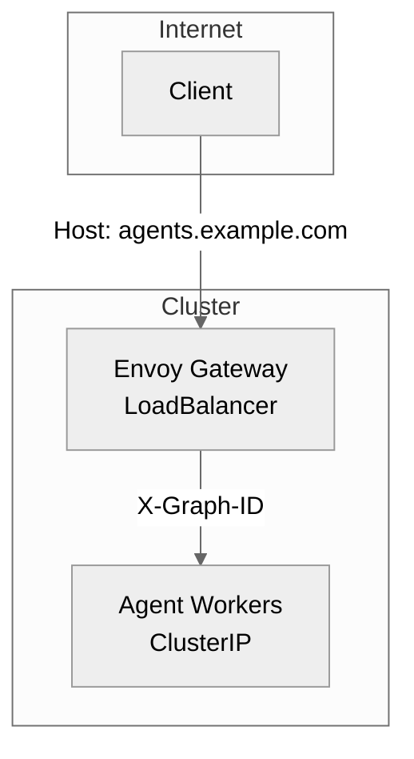
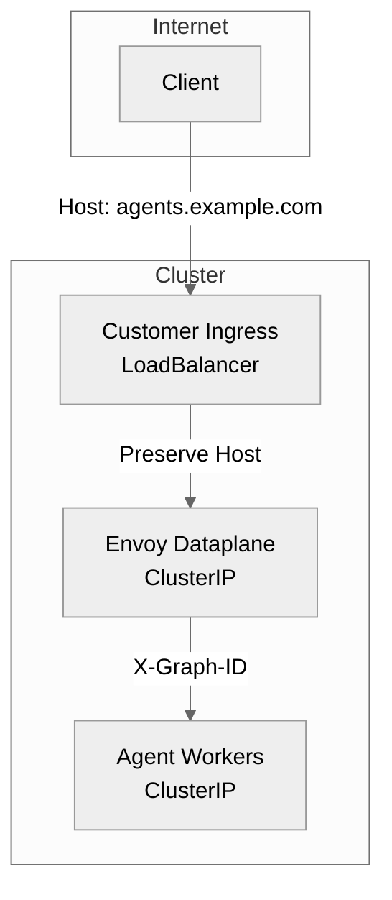
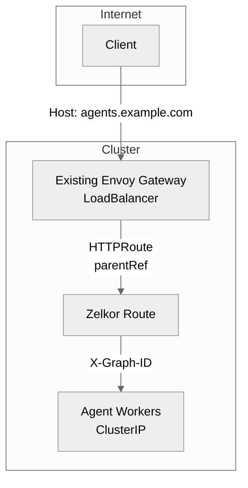

# Gateway Topologies

Zelkor uses **Envoy Gateway** and the Kubernetes Gateway API (`gateway.networking.k8s.io/v1`) for all external routing and internal intercept logic. Envoy Gateway is **required** even if you already have an Ingress controller like Traefik, NGINX, or ALB.

**Zelkor sandboxes the agent you already wrote.** It wraps the agent in a comprehensive security and operational perimeter without a rewrite. The agent can't break out, reach unauthorized data or networks, its prompts are verified, budget is controlled, and it is under observation.

* **Community Edition** is the self-hosted runtime.
* **Pro** adds SSO, team controls (budgets and approvals), and production HA / GitOps.
* **Enterprise** adds isolation and compliance on Pro (hardware sandbox, mTLS, retained audit, BAA).

## Published vs Internal Services

Zelkor only publishes the surfaces necessary for external access. All other components remain securely within the cluster.

* **Published (Public DNS):** Agent Protocol front door (`agents.example.com`), Langfuse UI (`langfuse.example.com`).
* **Internal (ClusterIP):** Agent workers, databases (Postgres, ClickHouse, Valkey, Qdrant), NeMo guardrails, and MCP servers. Your agent pods are never the public edge, and untrusted code stays sandboxed. Model API keys stay on the gateway, never mounted on the agent pod.

## Why Envoy Gateway is required

Envoy Gateway is not just a front door. It handles `X-Graph-ID` routing to reach specific agent workers, translates AI Gateway policies for prompt verification, and enforces strict rate limits. An existing Ingress controller cannot replace these deep Envoy integrations. 

To accommodate different cluster setups, Zelkor provides three topology options: Greenfield, Layered, and Shared.

## Greenfield Topology (Default)

Use this when you are deploying to a new cluster or you want Envoy Gateway to act as the primary internet-facing LoadBalancer.

The installation scripts use this by default. Envoy Gateway creates a standard LoadBalancer Service.

## Layered Topology

Use this when you already have a non-Envoy front door (like NGINX, Traefik, or an AWS ALB) handling TLS, DNS, and WAF for your cluster.

In this topology, Envoy Gateway creates a `ClusterIP` Service instead of a LoadBalancer. You configure your existing Ingress to forward traffic for `agents.example.com` and `langfuse.example.com` to the Envoy `ClusterIP`, ensuring you preserve the `Host` header. 

To use this with the install scripts, pass `--topology layered`.

## Shared Topology

Use this when you already have Envoy Gateway installed in your cluster and you want Zelkor to attach its routes to your existing `GatewayClass` and `Gateway`.

In this scenario, Zelkor skips installing the Envoy Gateway controller and instead relies on your existing Envoy infrastructure. You provide the name of your existing `Gateway` and `GatewayClass` so Zelkor can bind its `HTTPRoute` and `AIGatewayRoute` resources to it.

To use this with the install scripts, pass `--topology shared` along with `--parent-ref-name`, `--parent-ref-namespace`, and `--gateway-class`.