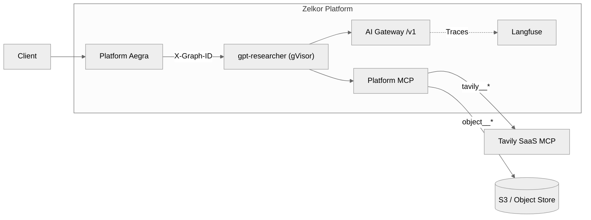

# GPT Researcher (deep agents)

## Business Case

**Original Case:** [GPT Researcher](https://github.com/assafelovic/gpt-researcher) is an autonomous agent designed for comprehensive online research. It breaks down a research task into sub-topics, searches the web, and aggregates the findings into a detailed report. By wrapping it in Zelkor, you run this complex, third-party workload securely without rewriting its logic.

## Zelkor Features Demonstrated

Bring GPT Researcher's unmodified `deep_agents/` graph to run securely on Zelkor. This example demonstrates:
- **gVisor Isolation**: The agent pod uses gVisor hardware boundaries.
- **AI Gateway Interception**: LLM calls go through the in-cluster AI Gateway rather than directly to providers.
- **Observability**: Execution traces automatically land in Langfuse.
- **External MCP Injection**: Web search uses Tavily’s hosted MCP through the platform `/mcp` route — the worker never holds a Tavily key.
- **Object MCP**: Final reports are shipped to S3/Object Storage seamlessly.

## Architecture



## Prerequisites

- Zelkor CE installed; `zelkor env use` points at that cluster
- RuntimeClass `gvisor` on the cluster
- Docker on PATH (unless `ZELKOR_SKIP_BUILD=1`)
- Tavily registered on the **platform** release ([Register extra MCP backends](../../../docs/mcp-extra-backends.md))

## Register Tavily, then deploy

Create a Secret with data key `apiKey` (not in git). Overlay the platform release:

```yaml
workspace:
  tools:
    extraBackends:
      - name: tavily
        fqdn:
          hostname: mcp.tavily.com
          port: 443
        path: /mcp
        apiKey:
          secretRef:
            name: tavily-mcp-key
```

```bash
helm upgrade zelkor-platform charts/zelkor-platform \
  --namespace zelkor \
  --reuse-values \
  -f tavily-platform-overlay.yaml
zelkor deploy -f examples/armored-agents/gpt-researcher/values.yaml
zelkor run --graph-id gpt-researcher --input "Summarize the latest gVisor isolation model"
```

`deploy -f` fails if `tavily` is missing from `workspace.tools.extraBackends`. It builds the sibling `Dockerfile` at the repo root, then kind-loads (kind) or pushes (`--registry` / `ZELKOR_IMAGE_REGISTRY` off kind). Skip the build with `ZELKOR_SKIP_BUILD=1` when the wrap image is already in the registry.

See [Deploy an Agent](../../../docs/agent-deploy.md). If `tools/list` has no `tavily__*` prefix, [hosted extra MCP tools missing](../../../docs/kb/hosted-mcp-tls.md).

## Tavily credits

`quick_search` is Tavily **search**. `deep_research` is Tavily **research** (`tavily__tavily_research`) — a separate, more expensive product. The unmodified researcher prompt calls `deep_research` **once per report section**. An outline with seven sections can mean seven research jobs plus the editor’s searches. Usage is on Tavily’s dashboard, not in Zelkor.

In Langfuse, on the `gpt-researcher` trace, count TOOL **`deep_research`** (research) vs **`quick_search`** (search). Tool argument bodies appear only when `captureContent` is on.

## What Zelkor adds

`langgraph.json` and `graph.py` call unmodified `create_deep_agent` and GPTR prompts. Search tools `quick_search` / `deep_research` call `mcp_inject.call_tool` for `tavily__tavily_search` and `tavily__tavily_research`. The wrap maps `DEFAULT_LLM_MODEL` (`openai/…` or a gateway id such as `gpt-oss:20b`) to `openai:…` and sets `FAST_LLM` / `SMART_LLM` / `STRATEGIC_LLM` so GPTR’s inner researcher does not call `gpt-5.4*` on the in-cluster gateway.

Enable object MCP on the platform release. After the run, the scratch directory is copied once. Keys are `gpt-researcher/<run-id>/<path>` (the store adds the tenant prefix). The agent does not receive S3 credentials. A missing object store does not change the research.
