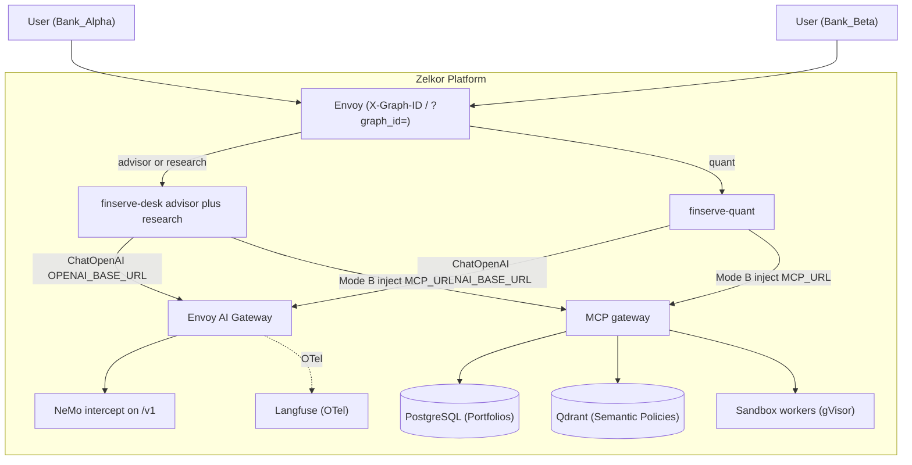

# FinServe AI: Multi-Tenant Wealth Management Reference Agents

FinServe AI is the reference **drop-in** demo for the Zelkor Platform: three Mode B `langchain.agents.create_agent` graphs (`FROM zelkor-aegra`) with no Zelkor SDKs. Clients use the **platform Aegra** Agent Protocol host. Guardrails, LLM routing, and MCP tools come from wrap + intercept + inject.

| Graph id | Deployment | Role |
| :--- | :--- | :--- |
| `finserve-advisor` | `finserve-desk` | Portfolio SQL + synthesis |
| `finserve-research` | `finserve-desk` (same process) | Policy RAG |
| `finserve-quant` | `finserve-quant` | Sandbox projections |

---

## 1. Capabilities & Platform Pillars

| Pillar | Implementation in FinServe AI | Platform Subsystem |
| :--- | :--- | :--- |
| **Conversational Guardrails** | Off-topic and jailbreak text refused on default `/v1` | **NeMo intercept** (not a graph node) |
| **Multi-Tenant Isolation** | MCP wrappers scope SQL and Qdrant by caller identity | **PostgreSQL** + **Qdrant** via MCP gateway |
| **Untrusted Code Execution** | Quant graph calls `sandbox__execute_python` | **gVisor** warm pool |
| **Policy-Governed LLM Routing** | `ChatOpenAI` via wrap `OPENAI_BASE_URL` | **Envoy AI Gateway** |
| **Full-Stack Observability** | Gateway OTel GenAI spans | **Langfuse** |
| **Stateful Orchestration** | Two ClusterIP workers; three graph ids | **Envoy** `X-Graph-ID` → worker; platform Aegra is the default |

---

## 2. Architecture Diagram



---

## 3. Quickstart & Usage

### A. Deploy via Helm

`./install.sh` (with `INSTALL_EXAMPLES=true`) applies the platform overlay (`aegra.workers` Service refs) and this chart. Manual:

```bash
helm dependency update examples/finserve/chart
helm upgrade --install finserve examples/finserve/chart \
  -f examples/finserve/chart/values-local.yaml \
  --wait --timeout 10m
```

Register on the platform release (already in `values-platform-overlay.yaml`):

```yaml
aegra:
  workers:
    - graphId: finserve-advisor
      service: finserve-desk
      port: 8000
    - graphId: finserve-research
      service: finserve-desk
      port: 8000
    - graphId: finserve-quant
      service: finserve-quant
      port: 8000
```

### B. Query via platform Aegra

```bash
curl -X POST http://127.0.0.1:8088/runs/wait \
  -H "Host: aegra.localhost" \
  -H "Content-Type: application/json" \
  -H "Authorization: Bearer dev:Bank_Alpha" \
  -H "X-Graph-ID: finserve-advisor" \
  -d '{
    "graph_id": "finserve-advisor",
    "input": {
      "messages": [{"role": "human", "content": "What is my portfolio valuation?"}]
    }
  }'
```

There is no `finserve.localhost` HTTPRoute by default.

---

## 4. Observability & Tracing

Open Langfuse at [http://langfuse.localhost:8088](http://langfuse.localhost:8088). LLM spans come from Envoy AI Gateway OTel, not an agent-side Langfuse SDK.

---

## 5. Automated Validation Matrix

```bash
# Platform conformance (no examples required)
INSTALL_EXAMPLES=false ./install.sh
pytest tests/ -v

# FinServe E2E smokes (platform Aegra, three graph ids)
pytest examples/finserve/tests/ -v
```

| Layer | Location | Coverage |
| :--- | :--- | :--- |
| Platform Gate | `tests/` | MCP, NeMo intercept, gVisor, extraBackends unit tests |
| FinServe E2E | `examples/finserve/tests/` | Agent Protocol smokes on the front door |

---

## 6. Mode B MCP

The graph source does not embed an MCP client. At worker process start, Zelkor lists tools from `MCP_URL` and binds them onto `langchain.agents.create_agent`. Each `tools/call` uses the run's tenant (`Authorization` + `X-Tenant-ID`).

Native tools: `postgres__query` / `list_tables` / `get_schema`, `qdrant__search_documents` (`finserve_policies`), `sandbox__execute_python`. Specialization is prompt-only.

Customer SaaS MCP is not part of this demo. Register extra servers on the platform overlay (`mcp.extraBackends`).
