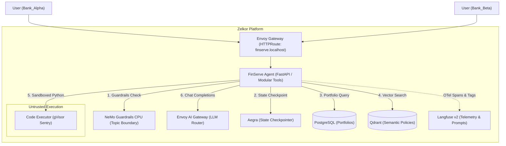

# FinServe AI: Multi-Tenant Wealth Management Reference Agent

FinServe AI is the reference application for the **Zelkor Platform**. It demonstrates how to build and operate multi-tenant, compliance-ready AI agents with native guardrails, vector memory, untrusted code sandboxing, policy-governed LLM routing, and full OpenTelemetry tracing.

---

## 1. Capabilities & Platform Pillars

| Pillar | Implementation in FinServe AI | Platform Subsystem |
| :--- | :--- | :--- |
| **Conversational Guardrails** | Rejects off-topic, chit-chat, and out-of-domain queries | **NeMo Guardrails CPU** (FastAPI / Colang) |
| **Multi-Tenant Isolation** | Scopes relational records (`portfolios`) and vector policies (`finserve_policies`) by `tenant_id` | **PostgreSQL** + **Qdrant** |
| **Untrusted Code Execution** | Executes arbitrary quantitative calculations & projections in user-space isolation | **gVisor** (`RuntimeClass: gvisor`) |
| **Policy-Governed LLM Routing** | Standardized OpenAI-compatible inference with consumer key and rate-limit policies | **Envoy AI Gateway** (`/v1/chat/completions`) |
| **Full-Stack Observability** | Ingests multi-span execution waterfalls, token usage, and security tags | **Langfuse v2** (`/api/public/ingestion`) |
| **Stateful Orchestration** | Checkpoints multi-turn conversation state across turns | **Aegra** (`/threads/{thread_id}/runs`) |

---

## 2. Architecture Diagram



---

## 3. Quickstart & Usage

### A. Deploy via Helm

FinServe is packaged as a standalone Helm release in `examples/finserve/chart`:

```bash
helm upgrade --install finserve examples/finserve/chart \
  -f examples/finserve/chart/values-local.yaml \
  --wait --timeout 10m
```

### B. Querying the Agent via Gateway API

Execute queries using either `Authorization: Bearer dev:<tenant_id>` or `X-Tenant-ID`:

```bash
# Query Bank_Alpha portfolio holdings
curl -X POST http://127.0.0.1:8088/runs/stream \
  -H "Host: finserve.localhost" \
  -H "Content-Type: application/json" \
  -H "Authorization: Bearer dev:Bank_Alpha" \
  -d '{
    "assistant_id": "finserve_agent",
    "input": {
      "messages": [{"role": "user", "content": "What is our asset allocation policy for high-growth tech?"}]
    }
  }'
```

```bash
# Execute sandboxed financial projection on gVisor
curl -X POST http://127.0.0.1:8088/runs/stream \
  -H "Host: finserve.localhost" \
  -H "Content-Type: application/json" \
  -H "Authorization: Bearer dev:Bank_Alpha" \
  -d '{
    "assistant_id": "finserve_agent",
    "input": {
      "messages": [{"role": "user", "content": "Predict my portfolio growth over 5 years assuming 7% variance."}]
    }
  }'
```

---

## 4. Observability & Tracing

Open the Langfuse UI at [http://langfuse.localhost:8088](http://langfuse.localhost:8088) (`admin@zelkor.local` / `zelkor-dev-password`) to inspect live traces under the **FinServe AI** project:

- `nemo_guardrails_input_check`: Topic moderation latency and refusal status.
- `query_database_postgres`: Parameterized SQL query execution and record count.
- `search_policies_qdrant`: Semantic vector similarity scores and matched policy payloads.
- `execute_code_gvisor`: Sandboxed subprocess stdout, stderr, and container escape containment status.
- `ai_gateway_llm_chat`: Upstream model latency, token counts, and completion responses.

---

## 5. Automated Validation Matrix

Run the test suite to validate platform compliance:

```bash
pytest examples/finserve/tests/ -v
```

| Test Suite | Coverage |
| :--- | :--- |
| `test_base01_install.py` | Installation health, `/runs/stream` endpoints, and Langfuse trace ingestion |
| `test_base02_tenant_isolation.py` | Multi-tenant IDOR prevention between `Bank_Alpha` and `Bank_Beta` |
| `test_base03_gvisor_sandbox.py` | gVisor `RuntimeClass`, syscall interception (`mknod`, `dmesg`), and outbreak containment |
| `test_base04_stateful_memory.py` | Qdrant semantic policy retrieval and multi-turn Aegra thread state |
| `test_base05_nemo_guardrails.py` | NeMo Guardrails CPU off-topic refusal and on-topic pass-through |
