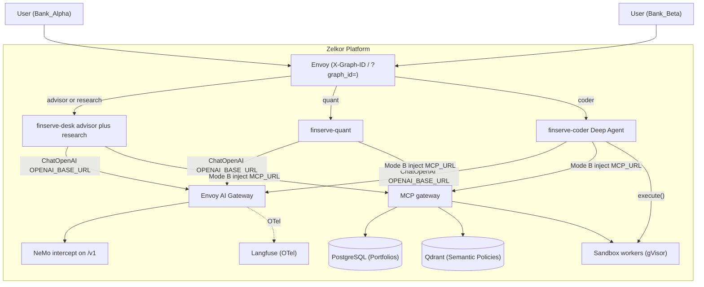

# FinServe AI: Multi-Tenant Wealth Management Reference Agents

FinServe AI is the reference **drop-in** demo for the Zelkor Platform: three Mode B `langchain.agents.create_agent` graphs (`FROM zelkor-aegra`) plus one deploy-first Deep Agent (`agent.json` + `AGENTS.md`, `FROM zelkor-aegra-deep`). Clients use the **platform Aegra** Agent Protocol host. Guardrails, LLM routing, and MCP tools come from wrap + intercept + inject.

| Graph id | Deployment | Role |
| :--- | :--- | :--- |
| `finserve-advisor` | `finserve-desk` | Portfolio SQL + synthesis |
| `finserve-research` | `finserve-desk` (same process) | Policy RAG |
| `finserve-quant` | `finserve-quant` | Sandbox projections |
| `finserve-coder` | `finserve-coder` | Custom Python on portfolio data (`execute()`) |

## What to copy

This chart is three aliases of [`charts/zelkor-agent`](../../charts/zelkor-agent) plus demo seed jobs. Customer agents should copy the **worker** pattern (image + `sharedRoute` + platform connection), not the demo extras.

| Copy | Do not copy onto `zelkor-agent` |
| :--- | :--- |
| Mode B wrap (`OPENAI_BASE_URL`, `MCP_URL`) | `job-db-init`, `job-langfuse-seed` |
| `sharedRoute` on `gateway.hosts.agents` | CNPG `Database` / `cnpgClusterName` (MCP/app schema only) |
| Unique `redis.prefix` per Deployment | `values-platform-overlay.yaml` tenant/NeMo blocks |
| [`values-tenants.yaml`](chart/values-tenants.yaml) (`auth.jwtSecret`, unsigned auth off) | `values-local.yaml` (kind secrets, `*.localhost`, `devTokens`) |

Minimal customer path: [docs/agent-deploy.md](../../docs/agent-deploy.md) (`zelkor deploy` or a single `zelkor-agent` release).

## Connect to your platform

`chart/values.yaml` ships **empty** connection fields. Point the release at an existing Zelkor install — do not assume release `zelkor-platform`, namespace `default`, or a kind Service name.

**Option A — Helm release name** (in-cluster naming `{release}-{suffix}`):

```yaml
platform:
  releaseName: <your-platform-release>   # parent: seed jobs + optional vanity HTTPRoute
desk:
  platform:
    releaseName: <your-platform-release> # constructs AI gateway + MCP URLs
  sharedRoute:
    host: <gateway.hosts.agents>
quant:
  platform:
    releaseName: <your-platform-release>
  sharedRoute:
    host: <gateway.hosts.agents>
coder:
  platform:
    releaseName: <your-platform-release>
  sharedRoute:
    host: <gateway.hosts.agents>
```

Postgres host is `{release}-postgresql`, or `{cnpgClusterName}-rw` when `platform.cnpgClusterName` is set. Override `platform.postgresHost` / worker `openaiBaseUrl` / `mcpUrl` when names differ.

**Option B — copy from the live platform Aegra Deployment** (same sources as `zelkor deploy`):

```bash
kubectl -n <ns> get deploy <platform-release>-aegra -o jsonpath='{range .spec.template.spec.containers[0].env[*]}{.name}={.value}{"\n"}{end}'
```

Set worker `platform.databaseUrl`, `valkeyUrl`, `mcpUrl`, `openaiBaseUrl`, and Langfuse keys from that env. Set `sharedRoute.host` from the platform value `gateway.hosts.agents`.

```bash
helm dependency update examples/finserve/chart
helm upgrade --install finserve examples/finserve/chart \
  --namespace <platform-namespace> \
  -f your-finserve-overlay.yaml
```

On the **platform** chart, apply [values-platform-overlay.yaml](chart/values-platform-overlay.yaml) (collection, tenant mappings, NeMo rails) and set `mcp.postgresMCP.databaseUrl` to **your** FinServe DB DSN. For JWT tenants (customer blueprint), also apply [values-platform-overlay-tenants.yaml](chart/values-platform-overlay-tenants.yaml) and [values-tenants.yaml](chart/values-tenants.yaml) with the **same** `auth.jwtSecret`. Do not apply `values-platform-overlay-local.yaml` or `values-local.yaml` outside kind.

## Kind eval

`./install.sh` (with `INSTALL_EXAMPLES=true`) applies the platform overlays and this chart with `values-local.yaml`. Manual:

```bash
helm dependency update examples/finserve/chart
helm upgrade --install finserve examples/finserve/chart \
  -f examples/finserve/chart/values-local.yaml \
  --wait --timeout 10m
```

```bash
curl -X POST http://127.0.0.1:8088/runs/wait \
  -H "Host: agents.localhost" \
  -H "Content-Type: application/json" \
  -H "Authorization: Bearer dev:Bank_Alpha" \
  -H "X-Graph-ID: finserve-advisor" \
  -d '{
    "graph_id": "finserve-advisor",
    "input": {
      "messages": [{"role": "human", "content": "What is my portfolio valuation?"}]
    }
  }'
```

There is no `finserve.localhost` HTTPRoute by default. Langfuse on kind: `http://langfuse.localhost:8088`.

## Architecture



## Validation

```bash
INSTALL_EXAMPLES=false ./install.sh
pytest tests/ -v

pytest examples/finserve/tests/ -v
```

| Layer | Location | Coverage |
| :--- | :--- | :--- |
| Platform Gate | `tests/` | MCP, NeMo intercept, gVisor, extraBackends unit tests |
| FinServe E2E | `examples/finserve/tests/` | Agent Protocol smokes on the front door |

## Mode B MCP

The graph source does not embed an MCP client. At worker process start, Zelkor lists tools from `MCP_URL` and binds them onto `langchain.agents.create_agent`. Each `tools/call` uses the run's tenant (`Authorization` + `X-Tenant-ID`).

Native tools: `postgres__query` / `list_tables` / `get_schema`, `qdrant__search_documents` (`finserve_policies`), `sandbox__execute_python`. Desk/quant specialization is prompt-only. Coder is deploy-first (`examples/finserve/coder/`); it uses Mode B `postgres__*` plus Deep Agents `execute()`.

Customer SaaS MCP is not part of this demo. Register extra servers on the platform overlay (`mcp.extraBackends`).
