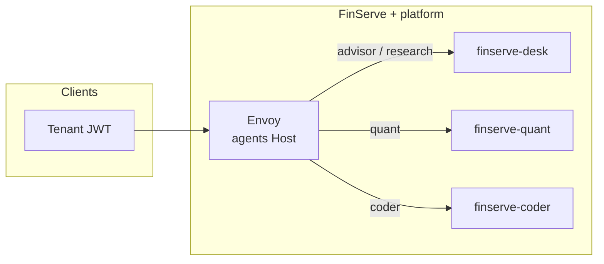
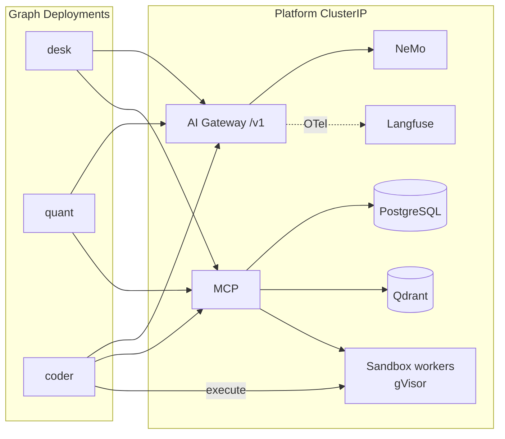

# FinServe AI: Multi-Tenant Wealth Management Reference Agents

FinServe AI is the reference **drop-in** demo for the Zelkor Platform. It demonstrates Zelkor's core advantage: **bring the agent you already wrote; it is sandboxed — it can't break out, reach unauthorized data or networks, its prompts are verified, budget controlled, and it is under observation.** You set a **model**, a **tool**, and an **agent**; those same objects run from the laptop Community Edition install to a shared cluster.

The demo consists of three Mode B `langchain.agents.create_agent` graphs (`FROM zelkor-aegra`) plus one deploy-first Deep Agent (`agent.json` + `AGENTS.md`, `FROM zelkor-aegra-deep`). Clients use the **platform Aegra** Agent Protocol host. Guardrails, LLM routing, and MCP tools come from wrap + intercept + inject.

| Graph id | Deployment | Role |
| :--- | :--- | :--- |
| `finserve-advisor` | `finserve-desk` | Portfolio SQL + synthesis |
| `finserve-research` | `finserve-desk` (same process) | Policy RAG |
| `finserve-quant` | `finserve-quant` | Sandbox projections |
| `finserve-coder` | `finserve-coder` | Custom Python on portfolio data (`execute()`) |

## Editions

FinServe AI runs across all Zelkor editions:
- **Community Edition**: Self-hosted runtime (gateway, tools, sandbox, traces).
- **Pro**: Adds SSO, team controls (budgets and approvals), and production HA / GitOps.
- **Enterprise**: Adds isolation and compliance on Pro (hardware sandbox, mTLS, retained audit, BAA).

## What to copy

This chart is three aliases of [`charts/zelkor-agent`](../../charts/zelkor-agent) plus demo seed jobs. Customer agents should copy the **worker** pattern (image + `sharedRoute` + platform connection), not the demo extras.

| Copy | Do not copy onto `zelkor-agent` |
| :--- | :--- |
| Mode B wrap (`OPENAI_BASE_URL`, `MCP_URL`) | `job-db-init`, `job-langfuse-seed` |
| `sharedRoute` on `gateway.hosts.agents` | CNPG `Database` / `cnpgClusterName` (MCP/app schema only) |
| `platform.releaseName` + `sharedRoute.host` (inherits checkpointer DSN + JWT from platform) | `values-platform-overlay.yaml` tenant/NeMo blocks |
| One graph per `zelkor-agent` release when you copy workers | `values-local.yaml` (kind secrets, `*.localhost`, `dev-key` consumer key) |

Minimal customer path: [docs/agent-deploy.md](../../docs/agent-deploy.md) (`zelkor deploy` or a single `zelkor-agent` release).

## Connect to your platform

`chart/values.yaml` ships **empty** connection fields. Point the release at an existing Zelkor install — do not assume release `zelkor-platform`, namespace `default`, or a kind Service name.

**Slim worker** (one `zelkor-agent` alias — copy this shape):

```yaml
graphId: my-agent   # or graphIds: [a, b] for a fat image
image:
  repository: ghcr.io/org/my-agent
  tag: "X.Y.Z"
platform:
  releaseName: <your-platform-release>
sharedRoute:
  host: <gateway.hosts.agents>
```

With `platform.releaseName` set, the worker inherits `{release}-aegra-datastore` (checkpointer DSN + Valkey), `{release}-tenant-jwt`, `{release}-tenant-jwks`, `{release}-langfuse-otel`, and constructs AI gateway + MCP URLs. Override `platform.databaseUrl` / `valkeyUrl` / `auth.*` only when names differ.

This umbrella chart repeats that block for desk / quant / coder. Parent `platform.releaseName` is for seed jobs only.

Postgres host for seeds is `{release}-postgresql`, or `{cnpgClusterName}-rw` when `platform.cnpgClusterName` is set.

```bash
helm dependency update examples/finserve/chart
helm upgrade --install finserve examples/finserve/chart \
  --namespace <platform-namespace> \
  -f your-finserve-overlay.yaml
```

On the **platform** chart, apply [values-platform-overlay.yaml](chart/values-platform-overlay.yaml) (collection, tenant mappings, NeMo rails) and set `workspace.tools.postgresMCP.databaseUrl` to **your** FinServe MCP DSN. Configure `platform.tenants.jwt` (issuer, audiences, JWKS) on the platform release — workers inherit JWT via `{release}-tenant-jwt`. Mint client tokens with `zelkor token mint`. Do not apply `values-platform-overlay-local.yaml` or `values-local.yaml` outside kind.

## Kind eval

`./install.sh` (with `INSTALL_EXAMPLES=true`) applies the platform overlays and this chart with `values-local.yaml`. Manual:

```bash
helm dependency update examples/finserve/chart
helm upgrade --install finserve examples/finserve/chart \
  -f examples/finserve/chart/values-local.yaml \
  --wait --timeout 10m
```

```bash
TOKEN="$(zelkor token mint --release zelkor-platform --tenant Bank_Alpha --namespace zelkor)"
curl -X POST http://127.0.0.1:8088/runs/wait \
  -H "Host: agents.localhost" \
  -H "Content-Type: application/json" \
  -H "Authorization: Bearer ${TOKEN}" \
  -H "X-Graph-ID: finserve-advisor" \
  -d '{
    "graph_id": "finserve-advisor",
    "input": {
      "messages": [{"role": "human", "content": "What is my portfolio valuation?"}]
    }
  }'
```

There is no `finserve.localhost` HTTPRoute by default. Langfuse on kind: `http://langfuse.localhost:8088`.

## Architecture

Envoy routes by `X-Graph-ID` / `?graph_id=` to ClusterIP graph Deployments. LLM and MCP stay on the platform.


```mermaid
flowchart LR
  subgraph clients["Clients"]
    user["Tenant JWT"]
  end
  subgraph ns["FinServe + platform"]
    front["Envoy\nagents Host"]
    desk["finserve-desk"]
    quant["finserve-quant"]
    coder["finserve-coder"]
  end
  user --> front
  front -->|"advisor / research"| desk
  front -->|quant| quant
  front -->|coder| coder
```


```mermaid
flowchart LR
  subgraph agents["Graph Deployments"]
    desk["desk"]
    quant["quant"]
    coder["coder"]
  end
  subgraph plat["Platform ClusterIP"]
    aigw["AI Gateway /v1"]
    nemo["NeMo"]
    mcp["MCP"]
    exec["Sandbox workers\ngVisor"]
    pg[("PostgreSQL")]
    qd[("Qdrant")]
    lf["Langfuse"]
  end
  desk --> aigw
  quant --> aigw
  coder --> aigw
  aigw --> nemo
  desk --> mcp
  quant --> mcp
  coder --> mcp
  coder -->|execute| exec
  mcp --> pg
  mcp --> qd
  mcp --> exec
  aigw -.->|"OTel"| lf
```

## Validation

```bash
INSTALL_EXAMPLES=false ./install.sh
pytest tests/ -v

pytest examples/finserve/tests/ -v
```

| Layer | Location | Coverage |
| :--- | :--- | :--- |
| Platform Gate | `tests/` | MCP, NeMo intercept, gVisor, extraBackends unit tests |
| FinServe E2E | `examples/finserve/tests/` | Agent Protocol smokes on the front door |

## Mode B MCP

The graph source does not embed an MCP client. Mode B inject lists tools from `MCP_URL` on each run and binds named tools via `MCP_INJECT_TOOLS` on the graph module. Each `tools/call` forwards the run's `Authorization` bearer (JWT tenant).

Native tools: `postgres__query` / `list_tables` / `get_schema`, `qdrant__search_documents` (`finserve_policies`), `sandbox__execute_python`. Desk/quant specialization is prompt-only. Coder is deploy-first (`examples/finserve/coder/`); it uses Mode B `postgres__*` plus Deep Agents `execute()`.

Customer SaaS MCP is not part of this demo. Register extra servers on the platform overlay (`workspace.tools.extraBackends`).
