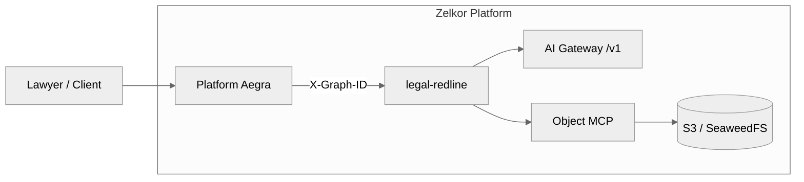

# Legal redline example

## Business Case

**Original Case:** This example demonstrates a single-pass clause review agent. The workload shape is based on [Uber, Scaling AI in Legal (2026-10-08)](https://www.uber.com/in/en/blog/building-ubers-redlining-agent/). The house contract is a small plain-text file in object storage. House playbook rules set accept, reject, or modify. The model then writes only the comment for the lawyer, and does not change that recommendation. 

One ClusterIP graph, `legal-redline`, reviews a single counterparty sentence. This chart is not part of the platform install. Deploy it after Zelkor is already running.

## Zelkor Features Demonstrated

This example demonstrates how Zelkor keeps the review inside house bounds:
- **Object MCP**: Agent safely fetches files from isolated object storage.
- **House-rule check**: Playbook rules run in an isolated worker, not on the lawyer's laptop.
- **Tenant Isolation**: Secure execution bounds ensure queries don't cross tenant boundaries.
- **AI Gateway Interception**: Output generation model logic is routed centrally.

## Architecture



## Deploy

Build the image, then install the chart against your platform release.

```bash
IMAGES=zelkor-example-legal-redline IMAGE_TAG=2.3.1 ./scripts/build-images.sh --push
helm dependency update examples/legal-redline/chart
helm upgrade --install legal-redline examples/legal-redline/chart \
  --namespace <platform-namespace> \
  --set legalRedline.platform.releaseName=<platform-release> \
  --set legalRedline.sharedRoute.host=<agents-host> \
  --set platform.releaseName=<platform-release> \
  --set objectStore.endpoint=http://<platform-release>-seaweedfs:8333 \
  --set objectStore.bucket=<object-bucket> \
  --set objectStore.accessKey=<object-access-key> \
  --set objectStore.secretKey=<object-secret-key>
```

On the platform release, enable object MCP and point it at the same object store. Platform `objectMCP.enabled` stays false until you apply this example's overlay.

```bash
helm upgrade <platform-release> charts/zelkor-platform \
  --namespace <platform-namespace> \
  --reuse-values \
  -f examples/legal-redline/chart/values-platform-overlay.yaml \
  --set workspace.tools.objectMCP.s3.endpoint=http://<platform-release>-seaweedfs:8333 \
  --set workspace.tools.objectMCP.s3.bucket=<object-bucket> \
  --set workspace.tools.objectMCP.s3.auth.accessKey=<object-access-key> \
  --set workspace.tools.objectMCP.s3.auth.secretKey=<object-secret-key> \
  --set seaweedfs.objectIdentity.accessKey=<object-access-key> \
  --set seaweedfs.objectIdentity.secretKey=<object-secret-key>
```

`seaweedfs.objectIdentity` must be a different access key than `seaweedfs.auth`. Reusing the admin key scopes that key to the object bucket and Langfuse event uploads fail.

Clients call the platform Agent Protocol host with `X-Graph-ID: legal-redline`. Do not put a provider key on the worker. Seed tenants are `harborline-freight` and `brightpath-clinics`. The fixture is not legal advice.
